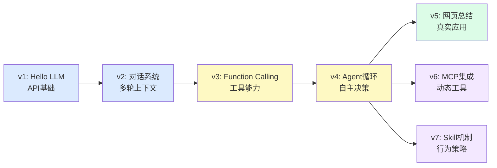
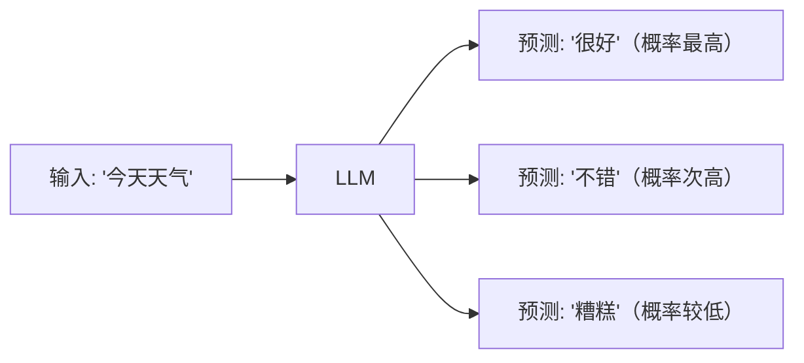
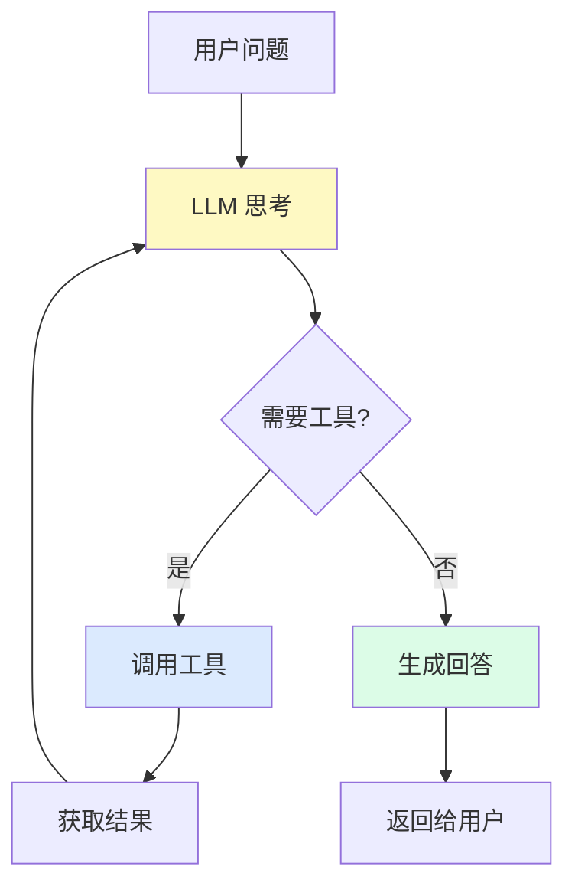

# AI Agent 教学项目总览

这份文档默认你已经看过 [README.md](/Users/edy/Documents/repos/ai-teaches-me-to-learn-ai/README.md:1)。  
如果 README 解决的是“这个项目值不值得打开”，那么这份文档解决的是：

- 这个项目整体在教什么原理
- 各个版本之间是什么关系
- 为什么要从 `v1` 一路走到 `v7`

## 这个项目到底在模拟什么？

这个项目的核心目标，是用**最基础的对话 API**，一步一步搭出一个教学版 Agent 框架。

这里有一个很重要的前提：

- 不依赖原生 function calling 特性
- 不依赖原生 skills / agents 能力
- 不依赖第三方 Agent 框架替你封装核心机制

而是通过下面这些最基本的东西，手动把能力拼出来：

- system prompt
- 消息历史
- 模型输出的文本
- Python 函数
- 循环控制逻辑

另外，本项目的示例代码虽然当前使用智谱的 API Key 和模型名，但底层调用方式采用的是 **OpenAI 兼容接口**。  
所以从教学角度看，这个项目并不绑定某一家厂商。只要模型服务兼容 OpenAI 风格的对话 API，一般都可以通过替换 `api_key`、`base_url` 和 `model` 来接入。

也就是说，这个项目真正想让你理解的是：

**很多看起来高级的 Agent 能力，本质上都可以从“对话 API + 程序控制逻辑”一步步长出来。**

## 你将学到什么

这个项目通过递进版本，带你从零开始理解 AI Agent 的工作原理：

可以把它看成两层：

- 主线：`v1 -> v2 -> v3 -> v4 -> v5`
- 扩展：`v6 -> v7`

主线负责把 Agent 的核心原理讲清楚。  
扩展负责说明：当核心循环已经成立以后，怎么继续往更灵活的工具接入和能力模块化方向发展。

## 先理解两个最重要的概念

### 什么是大语言模型（LLM）？

大语言模型可以先简单理解成一个**很强的文字预测器**。

给它一段输入，它会根据训练时学到的大量文本规律，预测接下来最可能出现的内容。

GPT、Claude 这一类模型，本质上都属于 LLM。  
它们通常通过 API 提供能力，供你的 Python 程序调用。

### 什么是 AI Agent？

普通 LLM 主要负责“生成文字”。  
AI Agent 则是在 LLM 外面再加一层，让它不只是说话，还能“做事”。

你可以把 Agent 理解成这样一个循环：

1. 用户提出问题
2. 模型先判断要不要使用工具
3. 如果要，就告诉程序该调用哪个函数、传什么参数
4. Python 代码真正执行这个函数
5. 把执行结果返回给模型
6. 模型根据结果继续回答，或者继续下一步

这个“思考 -> 工具 -> 再思考 -> 回答”的循环，就是 **Agent 循环**。  
整个项目最关键的一步，就是理解这个循环为什么成立。

## 为什么这条学习路径要这样设计？

因为这个项目不是想一上来把“完整 Agent”丢给你，而是想让你看到它是怎么长出来的。

### v1: 先学最小前提

你必须先知道怎么调用模型 API。  
如果连最基础的输入输出都不理解，后面的所有内容都会变成黑箱。

### v2: 再让对话连续起来

Agent 不是一次性问答系统。  
它至少要能依赖上下文，所以必须先理解消息历史是怎么工作的。

### v3: 再让模型有“使用工具”的能力

这是第一次从“只会说话”走向“可以驱动行动”。

关键点不是模型真的在执行 Python，  
而是模型会输出一个结构化请求，告诉程序该调用哪个函数。

### v4: 再把单次调用升级成循环

这是整个项目最关键的一步。

`v3` 只能处理一次工具调用。  
但很多任务需要：

- 先查一个信息
- 再根据结果做下一步
- 再决定任务是否完成

所以 `v4` 的本质是：

**把“单次函数调用”升级成“可连续多步推进任务的循环系统”。**

### v5: 把原理拼成真实应用

如果只停留在 `v4`，你学到的还更像框架原理。  
`v5` 的作用是把这些能力真正组合成一个能使用的小工具，让你看到前面的设计不是纸上谈兵。

### v6: 理解工具接入还能继续抽象

当你已经理解 Agent 会调用工具以后，下一步自然会问：

“工具一定要我手写注册吗？能不能按统一协议动态接入？”

`v6` 回答的就是这个问题。

### v7: 理解行为策略也能模块化

当你已经理解工具层之后，下一步自然会问：

“除了工具，Agent 的行为规则能不能也拆成可复用模块？”

`v7` 就是在演示这个方向。

## 学习路径详解

### v1: Hello GPT（第1天）
- **学会什么**：如何调用模型 API，理解请求和响应结构
- **这一版只新增了什么**：让 Python 和大模型成功对话
- **核心文件**：`code/v1_hello_gpt.py`
- **文档**：`docs/01-api-basics.md`

### v2: 对话系统（第2天）
- **学会什么**：如何维护多轮对话历史，理解系统提示的作用
- **这一版只新增了什么**：记住前面对话内容
- **核心文件**：`code/v2_conversation.py`
- **文档**：`docs/01-api-basics.md`（续）

### v3: 函数调用（第3-4天）
- **学会什么**：如何让模型决定什么时候调用你写的函数
- **这一版只新增了什么**：给模型“使用工具”的能力
- **核心文件**：`code/v3_with_functions.py`
- **文档**：`docs/02-function-calling.md`

### v4: Agent 循环（第5-7天）
- **学会什么**：如何让模型连续多步完成任务
- **这一版只新增了什么**：把一次工具调用升级成完整循环
- **为什么这一版最关键**：因为 Agent 的核心不在“能不能调工具”，而在“能不能根据结果继续下一步”
- **核心文件**：`code/v4_agent_loop.py`（同时包含 Agent 框架和使用示例）
- **文档**：`docs/03-agent-loop.md`

### v5: 网页总结工具（第8-10天）
- **学会什么**：如何把前面的能力拼成一个真实小工具
- **这一版只新增了什么**：从“原理演示”变成“可实际使用的小应用”
- **核心文件**：`code/v5_web_summarizer.py`
- **文档**：`docs/04-web-summarizer.md`

### v6: MCP 协议集成（进阶扩展）
- **学会什么**：如何通过统一协议动态接入外部工具
- **这一版只新增了什么**：工具不必全部手写硬编码，可以按标准接入
- **适合什么时候看**：当你已经理解主线，想进一步理解更接近实际系统的工具接入方式
- **核心文件**：`code/v6_mcp_agent.py`
- **文档**：`docs/05-mcp-integration.md`

### v7: Skill 机制（进阶扩展）
- **学会什么**：如何把可复用的行为策略封装成独立模块
- **这一版只新增了什么**：让 Agent 可以动态加载不同行为说明
- **适合什么时候看**：当你已经理解 Agent 主线，想继续理解“能力模块化”怎么做
- **核心文件**：`code/v7_agent_with_skills.py`，`skills/`
- **文档**：`docs/06-skills.md`
