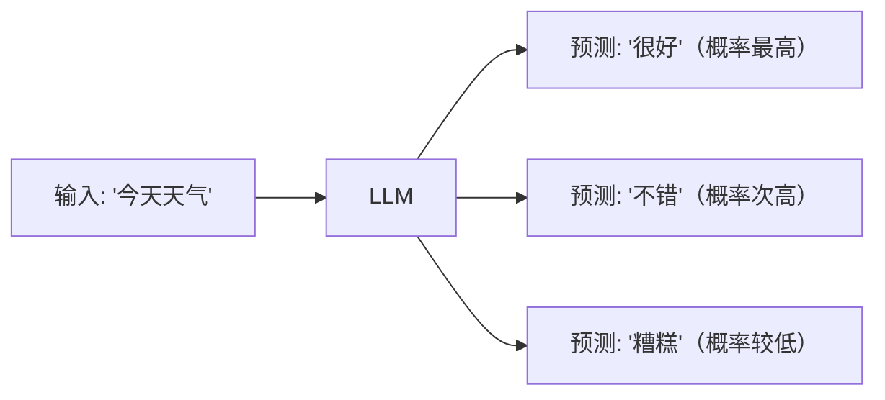
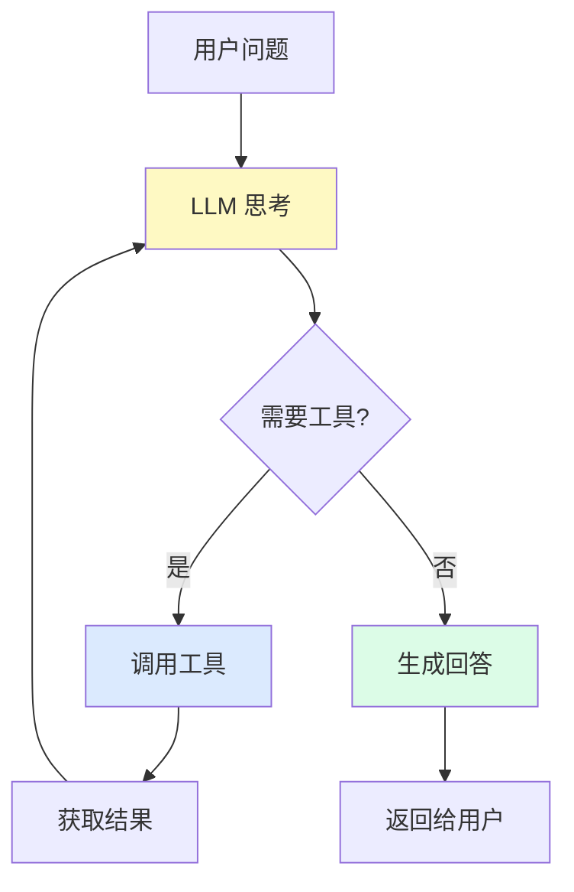
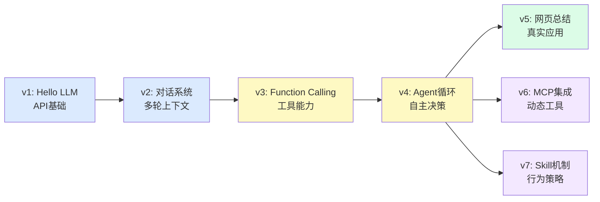

# 项目总览：从对话 API 到 Agent，到底走了几步

这份文档默认你已经看过 [README.md](../README.md)，知道项目目标和怎么把环境跑起来。

README 解决的是**这个项目要做什么、怎么开始**。这份文档解决的是：

- **概念层**：LLM 是什么？Agent 又是什么？
- **演进层**：为什么要从 v1 一路走到 v7？每一步只新增了什么本质能力？

读完这份文档，你应该能在脑子里画出一条清晰的路径：从"调用一次模型 API"到"完整 Agent + Skill + MCP"中间到底跨了哪几个台阶。

---

## 1. 先理解两个最重要的概念

### 什么是大语言模型（LLM）？

大语言模型可以先简单理解成一个**很强的文字预测器**。给它一段输入，它会根据训练时学到的大量文本规律，预测接下来最可能出现的内容。

```mermaid
graph LR
    A["输入: '今天天气'"] --> B[LLM]
    B --> C["预测: '很好'（概率最高）"]
    B --> D["预测: '不错'（概率次高）"]
    B --> E["预测: '糟糕'（概率较低）"]
```

GPT、Claude、GLM 这一类模型，本质上都属于 LLM。它们通常通过 API 提供能力，供你的 Python 程序调用。

### 什么是 AI Agent？

普通 LLM 主要负责"生成文字"。AI Agent 是在 LLM 外面再加一层，让它不只是说话，还能"做事"。

你可以把 Agent 理解成这样一个循环：

1. 用户提出问题
2. 模型先判断要不要使用工具
3. 如果要，就告诉程序该调用哪个函数、传什么参数
4. Python 代码真正执行这个函数
5. 把执行结果返回给模型
6. 模型根据结果继续回答，或者继续下一步

```mermaid
graph TD
    A[用户问题] --> B[LLM 思考]
    B --> C{需要工具?}
    C -->|是| D[调用工具]
    D --> E[获取结果]
    E --> B
    C -->|否| F[生成回答]
    F --> G[返回给用户]

    style B fill:#fef9c3
    style D fill:#dbeafe
    style F fill:#dcfce7
```

这个"思考 → 工具 → 再思考 → 回答"的循环，就是 **Agent 循环**。整个项目最关键的一步，就是理解这个循环为什么成立、怎么从一段普通对话 API 长出来。

---

## 2. v1 → v7 的演进地图

```mermaid
graph LR
    A[v1: Hello LLM<br/>API基础] --> B[v2: 对话系统<br/>多轮上下文]
    B --> C[v3: Function Calling<br/>工具能力]
    C --> D[v4: Agent循环<br/>自主决策]
    D --> E[v5: 网页总结<br/>真实应用]
    D --> F[v6: MCP集成<br/>动态工具]
    D --> G[v7: Skill机制<br/>行为策略]

    style A fill:#dbeafe
    style B fill:#dbeafe
    style C fill:#fef9c3
    style D fill:#fef9c3
    style E fill:#dcfce7
    style F fill:#f3e8ff
    style G fill:#f3e8ff
```

整条路径可以分成两层：

- **主线 `v1 → v5`**：把 Agent 的核心循环搭出来，并验证它能拼成真实小工具
- **扩展 `v6 → v7`**：在核心循环成立之后，演示工具接入和行为策略怎么进一步抽象

---

## 3. 每一版只新增了什么本质能力

每一版只解决一个具体问题。下面解释**为什么必须有这一版**，以及它的本质机制是什么。

### v1：你得先会调用模型 API

你必须先知道怎么和模型对话。这是后面所有内容的最小前提。如果连请求结构、响应结构、token 这些都不清楚，后面所有东西都会变成黑箱。

**本质**：通过 HTTP 请求把消息列表发给模型，拿回一段文本。

### v2：让对话连续起来

Agent 不是一次性问答。它必须能依赖上下文 —— 否则连"刚刚我们说了什么"都记不住。

**本质**：模型本身是无状态的，所有"记忆"都来自你每次请求时主动带上完整的消息历史。

### v3：让模型有"使用工具"的能力

这是第一次从"只会说话"走向"可以驱动行动"。但有个关键误解要先打破：**模型不是真的在运行你的 Python 函数**。

**本质**：你在 system prompt 里描述有哪些工具可用 → 模型在文本里输出一段约定格式的 JSON 来"请求"调用 → Python 代码识别这段 JSON 并真正执行函数 → 把结果再发回给模型。

没有什么魔法，全部建立在"模型输出文本 + 程序解析文本"的基础上。

### v4：把单次调用升级成循环

v3 只能处理一次工具调用。但现实任务往往需要：先查 A，根据 A 的结果再查 B，再根据 B 的结果做 C，最后才能回答用户。

v4 做的事情就是：

**把"单次函数调用"升级成"可连续多步推进任务的循环系统"。**

**本质**：在 v3 外面套一个 `while`，只要模型还在请求工具就继续，直到它直接给出自然语言回答，循环才停止。这就是 **Agent Loop**。

这是整个项目最关键的一跳 —— 一旦你理解了它，你就理解了"Agent 自主性"到底是什么。

### v5：把原理拼成一个真实小工具

如果只停留在 v4，学到的还更像"框架原理演示"。v5 用 v4 的框架做一个真实可用的网页总结器，验证：

**只靠前面手工搭出来的对话 API + 工具调用 + 循环机制，能不能拼成一个真正可用的小应用？**

答案是可以。v5 也是主线学习的终点 —— 走到这里你已经把核心讲完了。

### v6：理解工具接入还能继续抽象

主线走完会自然产生一个问题：

> "工具一定要我手写注册吗？能不能按统一协议动态接入？"

v6 回答这个问题：通过 MCP 协议，一个工具的来源可以是外部进程，而不是你代码里硬编码的函数。

**本质**：MCP = 用 JSON-RPC over stdio 让外部进程告诉你它有哪些工具 + 怎么调用 → 你的客户端把这些转成 v3/v4 框架能用的 `tools` 和 `functions` 结构 → 后面 Agent Loop 完全不用改。

### v7：理解行为策略也能模块化

主线走完还会产生另一个问题：

> "除了工具，Agent 的行为规则能不能也拆成可复用模块？"

v7 回答这个问题：把一组"在某种情境下该怎么做事"的指令封装成 Markdown 文件，运行时按需注入到 system prompt。

**本质**：Skill 不是新机制 —— 它就是一段被命名、被按需注入的 system prompt 片段。Tool 解决"能做什么"，Skill 解决"该怎么做"。

---

## 4. 看完这份文档之后

如果你能回答下面这几个问题，说明整体脉络已经在你脑子里了：

- 为什么 v1 → v2 → v3 → v4 是必须按顺序学的？
- v3 和 v4 的本质差别只有一个字 —— 是什么？
- v6 的 MCP 和 v3/v4 的工具机制是替代关系还是叠加关系？
- v7 的 Skill 和 v3 的 Tool，分别在 Agent 系统里扮演什么角色？

接下来就可以打开 [docs/01-api-basics.md](01-api-basics.md) 开始学 v1 和 v2 了。
