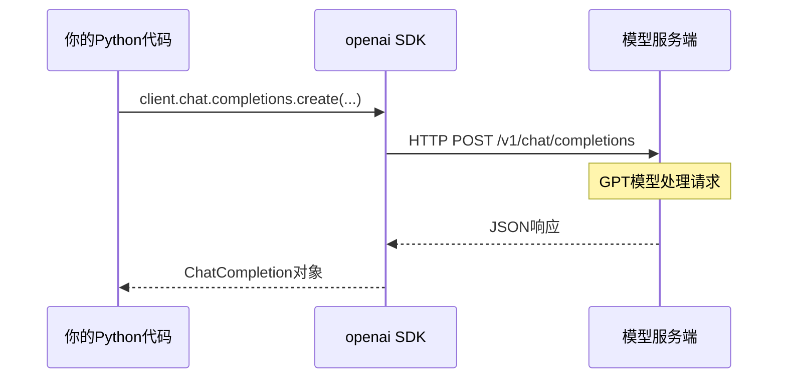
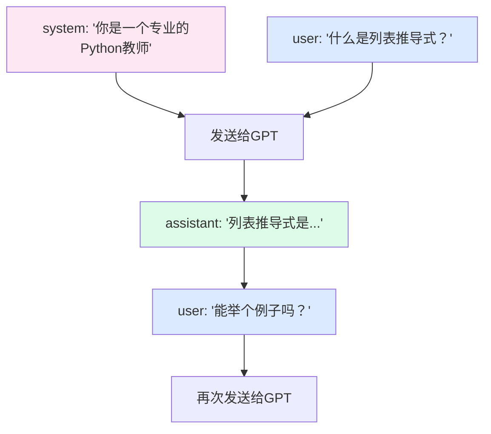

# 第一章：OpenAI 兼容对话 API 基础

## 本章目标

- [ ] 理解 OpenAI API 的请求/响应结构
- [ ] 掌握消息格式（role + content）
- [ ] 能独立调用 API 并处理响应
- [ ] 理解系统提示（System Prompt）的作用
- [ ] 实现一个简单的多轮对话系统

---

## 0. 先对齐一件事：后面所有能力都从这里长出来

这一章看起来最基础，但它决定了后面整个项目能不能成立。

因为本项目有一个刻意的限制：

**后面所有 tool、agent loop、skill、MCP 能力，都会建立在最基础的对话 API 之上，而不是依赖任何原生 Agent 特性。**

所以这一章真正要学会的，不只是“怎么发一个请求”，而是：

- 模型输入到底长什么样
- 模型输出到底长什么样
- 消息历史为什么可以决定上下文

后面所有更高级的能力，本质上都只是对这些基础积木的继续组合。

---

## 1. 为什么需要 API？

大模型运行在模型厂商的服务器上，我们通过 **HTTP 请求**与它通信。  
本项目的代码示例当前使用智谱的配置，但调用方式采用的是 **OpenAI 兼容接口**，所以并不只适用于某一家厂商。

每次对话都是一个请求：



**openai SDK** 帮我们封装了 HTTP 细节，我们只需要调用 Python 函数。  
如果供应商兼容 OpenAI 风格接口，通常也可以沿用同样的代码结构。

---

## 2. 消息格式：role + content

OpenAI API 使用一个消息列表（messages）来表示对话，每条消息有两个字段：

| role | 含义 | 使用场景 |
|------|------|----------|
| `system` | 系统指令 | 设定 AI 的角色和行为规则 |
| `user` | 用户输入 | 你发送的消息 |
| `assistant` | AI 回复 | GPT 生成的回复 |



**关键理解**：每次请求都要把**完整的对话历史**发给 API，GPT 没有自己的记忆，上下文完全由你管理。

---

## 3. v1 代码讲解：Hello GPT

完整代码在 `code/v1_hello_gpt.py`，运行方式：
```bash
python code/v1_hello_gpt.py
```

### 逐行解析

```python
from dotenv import load_dotenv  # 从.env文件加载环境变量
import os
from openai import OpenAI

load_dotenv()  # 读取.env文件，把 API Key 加入环境变量

# 创建客户端（这里使用智谱的兼容接口；也可替换成其他 OpenAI 兼容厂商）
client = OpenAI()

# 发送一条消息，获取回复
response = client.chat.completions.create(
    model="gpt-4o-mini",          # 使用的模型（mini版更便宜，适合学习）
    max_tokens=1024,               # 最多生成多少个Token
    messages=[
        {"role": "user", "content": "用一句话解释什么是人工智能"}
    ]
)

# 从响应中提取文本内容
print(response.choices[0].message.content)
```

### 响应对象结构

`response` 是一个 `ChatCompletion` 对象，关键字段：

```python
response.choices[0].message.content  # AI回复的文本
response.choices[0].finish_reason    # 停止原因: "stop"=正常结束, "length"=达到max_tokens
response.usage.prompt_tokens         # 输入消耗的Token数
response.usage.completion_tokens     # 输出消耗的Token数
response.usage.total_tokens          # 总Token数（计费依据）
```

> **Token 是什么？** 简单理解，1个Token约等于0.75个英文单词，或0.5个汉字。API按Token数量计费。

---

## 4. v2 代码讲解：对话系统

完整代码在 `code/v2_conversation.py`，运行方式：
```bash
python code/v2_conversation.py
```

### 核心变化：维护对话历史

```python
# v1：只发当前消息
messages = [{"role": "user", "content": user_input}]

# v2：发送完整对话历史
messages = []  # 对话开始时为空

# 每轮对话：
messages.append({"role": "user", "content": user_input})   # 加入用户消息
response = client.chat.completions.create(...)              # 发送全部历史
messages.append({"role": "assistant", "content": reply})   # 加入AI回复
```

### 系统提示（System Prompt）

系统提示是对话列表中的**第一条消息**（role 为 `system`），用于设定 AI 的行为：

```python
messages = [
    {
        "role": "system",
        "content": "你是一个专业的Python教学助手。回答要简洁清晰，多举代码例子。"
    }
]
```

**为什么系统提示有效？** GPT 被训练为尊重系统提示，把它当作"规则"来遵守。这是 Prompt Engineering 的基础。

### 关键参数解释

| 参数 | 含义 | 推荐值 |
|------|------|--------|
| `model` | 使用的GPT模型 | `gpt-4o-mini`（便宜）或 `gpt-4o`（更强） |
| `max_tokens` | 最大输出长度 | 512~2048 |
| `temperature` | 随机性（0=确定，2=随机） | 教学用0.7，代码生成用0.2 |

---

## 5. 常见问题

**Q: API Key 在哪里获取？**
A: 登录 platform.openai.com → API Keys → Create new secret key

**Q: 调用一次 API 要花多少钱？**
A: gpt-4o-mini 约 $0.00015/1K tokens，一次普通对话大约 $0.0001，非常便宜。

**Q: 为什么每次都要发送完整对话历史？**
A: GPT 是无状态的（stateless），每次请求都是独立的，它不知道之前说了什么。上下文管理完全是你的代码责任。

**Q: temperature 设为 0 是什么效果？**
A: 输出几乎固定（贪婪解码），适合需要确定性回答的场景（如代码生成、数据提取）。

---

## 6. 下一步

v1 和 v2 让 GPT 能"说话"，但它只能生成文字，无法执行任何操作。

下一章，我们学习 **Function Calling**，让 GPT 具备"行动"能力：调用你写的Python函数，获取实时数据，执行真实操作。

继续：[第二章：Function Calling →](./02-function-calling.md)
