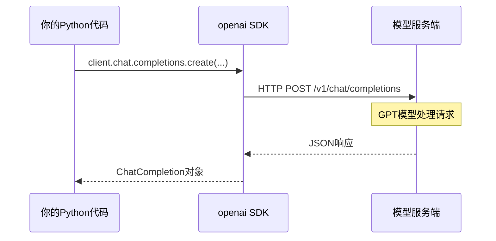
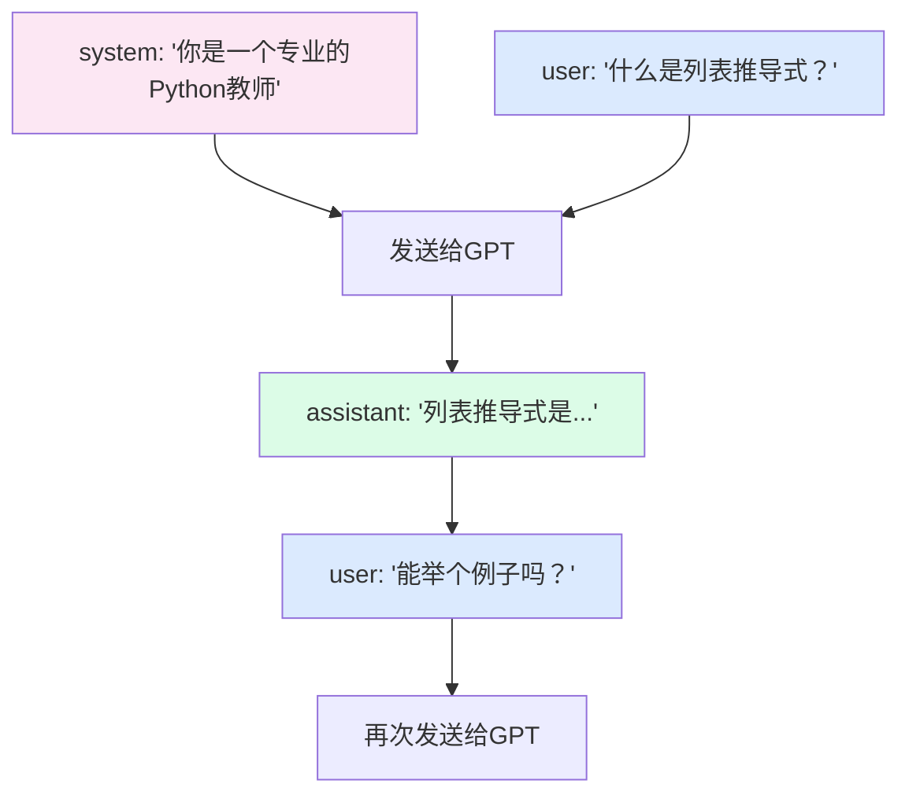

# 第一章：OpenAI 兼容对话 API 基础

## 本章目标

- [ ] 理解 OpenAI API 的请求/响应结构
- [ ] 掌握消息格式（role + content）
- [ ] 能独立调用 API 并处理响应
- [ ] 理解系统提示（System Prompt）的作用
- [ ] 实现一个简单的多轮对话系统

---

## 0. 先对齐一件事：后面所有能力都从这里长出来

这一章看起来最基础，但它决定了后面整个项目能不能成立。

因为本项目有一个刻意的限制：

**后面所有 tool、agent loop、skill、MCP 能力，都会建立在最基础的对话 API 之上，而不是依赖任何原生 Agent 特性。**

所以这一章真正要学会的，不只是“怎么发一个请求”，而是：

- 模型输入到底长什么样
- 模型输出到底长什么样
- 消息历史为什么可以决定上下文

后面所有更高级的能力，本质上都只是对这些基础积木的继续组合。

---

## 1. 为什么需要 API？

大模型运行在模型厂商的服务器上，我们通过 **HTTP 请求**与它通信。  
本项目的代码示例当前使用智谱的配置，但调用方式采用的是 **OpenAI 兼容接口**，所以并不只适用于某一家厂商。

每次对话都是一个请求：


```mermaid
sequenceDiagram
    participant Code as 你的Python代码
    participant SDK as openai SDK
    participant API as 模型服务端

    Code->>SDK: client.chat.completions.create(...)
    SDK->>API: HTTP POST /v1/chat/completions
    Note over API: GPT模型处理请求
    API-->>SDK: JSON响应
    SDK-->>Code: ChatCompletion对象
```

**openai SDK** 帮我们封装了 HTTP 细节，我们只需要调用 Python 函数。  
如果供应商兼容 OpenAI 风格接口，通常也可以沿用同样的代码结构。

---

## 2. 消息格式：role + content

OpenAI API 使用一个消息列表（messages）来表示对话，每条消息有两个字段：

| role | 含义 | 使用场景 |
|------|------|----------|
| `system` | 系统指令 | 设定 AI 的角色和行为规则 |
| `user` | 用户输入 | 你发送的消息 |
| `assistant` | AI 回复 | GPT 生成的回复 |


```mermaid
graph TD
    A["system: '你是一个专业的Python教师'"] --> D[发送给GPT]
    B["user: '什么是列表推导式？'"] --> D
    D --> E["assistant: '列表推导式是...'"]
    E --> F["user: '能举个例子吗？'"]
    F --> G[再次发送给GPT]

    style A fill:#fce7f3
    style B fill:#dbeafe
    style E fill:#dcfce7
    style F fill:#dbeafe
```

**关键理解**：每次请求都要把**完整的对话历史**发给 API，GPT 没有自己的记忆，上下文完全由你管理。

---

## 3. v1 代码讲解：Hello LLM

完整代码在 `code/v1_hello_gpt.py`，运行方式：
```bash
python code/v1_hello_gpt.py
```

### 逐行解析

```python
import os
from dotenv import load_dotenv
from openai import OpenAI

load_dotenv()  # 把 .env 里的变量加载到 os.environ

# 创建客户端：api_key 和 base_url 都从环境变量读，不写死任何一家厂商
client = OpenAI(
    api_key=os.getenv("LLM_API_KEY"),
    base_url=os.getenv("LLM_BASE_URL"),
)

# 发送一条消息，获取回复
response = client.chat.completions.create(
    model=os.getenv("LLM_MODEL"),     # 模型名也从环境变量读
    max_tokens=1024,                   # 最多生成多少个 token
    messages=[
        {"role": "user", "content": "用一句话解释什么是人工智能"}
    ]
)

# 从响应中提取文本内容
print(response.choices[0].message.content)
```

注意：所有"和厂商相关"的配置（key、base_url、模型名）都通过 `os.getenv` 从 `.env` 读取。这就是项目"不绑定某一家厂商"的具体实现 —— 代码里没有任何厂商的硬编码字符串。

### 响应对象结构

`response` 是一个 `ChatCompletion` 对象，关键字段：

```python
response.choices[0].message.content  # AI回复的文本
response.choices[0].finish_reason    # 停止原因: "stop"=正常结束, "length"=达到max_tokens
response.usage.prompt_tokens         # 输入消耗的Token数
response.usage.completion_tokens     # 输出消耗的Token数
response.usage.total_tokens          # 总Token数（计费依据）
```

> **Token 是什么？** 简单理解，1个Token约等于0.75个英文单词，或0.5个汉字。API按Token数量计费。

---

## 4. v2 代码讲解：对话系统

完整代码在 `code/v2_conversation.py`，运行方式：
```bash
python code/v2_conversation.py
```

### 核心变化：维护对话历史

```python
# v1：只发当前消息
messages = [{"role": "user", "content": user_input}]

# v2：发送完整对话历史
messages = []  # 对话开始时为空

# 每轮对话：
messages.append({"role": "user", "content": user_input})   # 加入用户消息
response = client.chat.completions.create(...)              # 发送全部历史
messages.append({"role": "assistant", "content": reply})   # 加入AI回复
```

### 系统提示（System Prompt）

系统提示是对话列表中的**第一条消息**（role 为 `system`），用于设定 AI 的行为：

```python
messages = [
    {
        "role": "system",
        "content": "你是一个专业的Python教学助手。回答要简洁清晰，多举代码例子。"
    }
]
```

**为什么系统提示有效？** GPT 被训练为尊重系统提示，把它当作"规则"来遵守。这是 Prompt Engineering 的基础。

### 关键参数解释

| 参数 | 含义 | 推荐值 |
|------|------|--------|
| `model` | 使用的模型名 | 从 `LLM_MODEL` 环境变量读，由你在 `.env` 里指定 |
| `max_tokens` | 单次回复最大输出长度（token 数） | 512 ~ 2048 |
| `temperature` | 随机性（0 = 确定，2 = 随机） | 教学场景 0.7，代码生成 0.2 |

---

## 5. 常见问题

**Q: API Key 在哪里获取？**
A: 看你用哪家厂商。`.env.example` 默认指向智谱（注册后在控制台拿 key），但只要是兼容 OpenAI 风格 API 的厂商都可以，改 `LLM_BASE_URL` 和 `LLM_API_KEY` 即可。

**Q: 一次 API 调用要花多少钱？**
A: 取决于厂商和模型。教学场景多数厂商的小模型每次调用都在分级，足够学习用。具体定价看你选的那家厂商的控制台。

**Q: 为什么每次都要发送完整对话历史？**
A: 大模型本身是无状态的（stateless），每次请求都是独立的，它不知道之前说了什么。上下文管理完全是你的代码责任。这是 v2 的核心。

**Q: temperature 设为 0 是什么效果？**
A: 输出几乎固定（贪婪解码），适合需要确定性回答的场景（如代码生成、数据提取）。

---

## 6. 下一步

v1 和 v2 让 GPT 能"说话"，但它只能生成文字，无法执行任何操作。

下一章，我们学习 **Function Calling**，让 GPT 具备"行动"能力：调用你写的Python函数，获取实时数据，执行真实操作。

继续：[第二章：Function Calling →](./02-function-calling.md)
