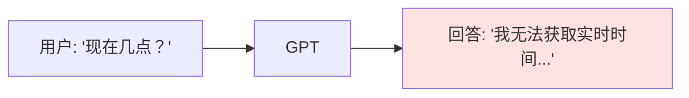
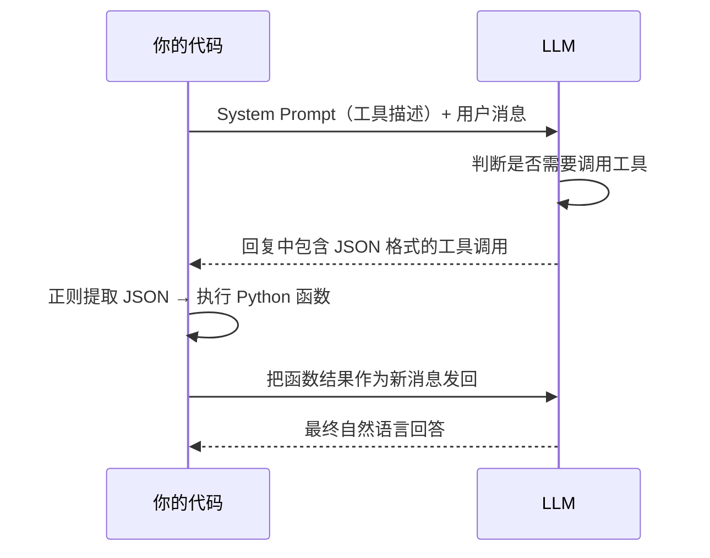

# 第二章：Function Calling

## 本章目标

- [ ] 理解 Function Calling 的工作原理
- [ ] 掌握函数定义的 JSON Schema 格式
- [ ] 实现函数调用检测和结果处理
- [ ] 理解为什么需要两次 API 调用

---

## 0. 先记住：Function Calling 不等于模型真的在运行 Python

第一次接触 Function Calling 时，最容易误会的一点是：

“模型是不是直接调用了我的 Python 函数？”

答案是：**不是。**

更准确地说，Function Calling 做的是这件事：

1. 模型先判断自己需不需要工具
2. 如果需要，它会输出一段结构化信息
3. 这段信息告诉你的程序：要调用哪个函数、参数是什么
4. 真正执行函数的人，是你的 Python 代码
5. 执行结果再返回给模型
6. 模型最后根据结果生成回答

所以你可以把它记成一句话：

**模型负责“提出调用请求”，Python 负责“真正执行函数”。**

---

## 1. 问题：LLM 无法执行操作

v2 的对话系统有一个根本限制：GPT **只能生成文字**，不能执行任何操作。



Function Calling 解决了这个问题——让 GPT **决定何时调用你的函数**。

---

## 2. Function Calling 的工作原理

你向 LLM 提供函数的**描述**（不是代码），LLM 决定是否需要调用，然后告诉你调用哪个函数、传什么参数。**实际执行由你的代码完成**。

如果要再说得更白话一点：

- LLM 像一个“会提建议的人”
- 你的 Python 程序像一个“真正动手的人”

LLM 会说：

> “我建议现在调用 `get_current_time()`。”

但真正去运行 `get_current_time()` 的，不是 LLM，而是你的程序。

### 谁负责什么？

把职责拆开以后，就会清楚很多：

- **LLM 负责**：判断要不要用工具、选哪个工具、组织参数
- **Python 负责**：找到对应函数、执行函数、拿到结果、再发回给模型

这也是为什么 Function Calling 本质上是“模型和程序协作”，而不是“模型自己会执行代码”。

### 两种实现方式

**方式一：API 内置支持**（如 OpenAI 的 `tools` 参数）
- API 提供专门的参数来传递工具定义
- 响应中有结构化的 `tool_calls` 字段
- 简单但依赖特定 API

**方式二：手动实现**（本教程采用）
- 通过 **prompt 工程** 告诉模型可用工具
- 让模型在回复中输出 **JSON 格式** 的工具调用
- 用 **正则表达式** 提取 JSON 并执行
- 更通用，适用于任何对话 API



**关键点**：这是**两次 API 调用**。第一次 LLM 说"我要调用这个工具"，第二次才是真正的回答。

### 为什么通常需要两次 API 调用？

因为模型第一次其实还不知道工具执行后的结果。

举个例子：

> 用户："现在几点？"

第一次调用时，模型最多只能说：

> “我需要调用 `get_current_time`”

这一步它只是提出请求，还没有拿到真实时间。

然后你的 Python 程序执行：

```python
get_current_time()
```

假设得到结果：

```text
2026-04-30 15:20:10
```

这时你再把结果发回模型，模型第二次才有足够信息回答：

> “现在时间是 2026-04-30 15:20:10。”

所以第一次调用解决的是：

- 要不要用工具？
- 用哪个工具？
- 参数是什么？

第二次调用解决的是：

- 拿到工具结果后，怎么对用户说人话？

---

## 3. 工具定义格式

我们使用简化的格式来定义工具：

```python
tools = [
    {
        "name": "get_current_time",          # 工具名（LLM 用来识别）
        "description": "获取当前的日期和时间",  # 描述（LLM 据此决定是否调用）
        "parameters": {}                      # 参数定义（空字典表示无参数）
    },
    {
        "name": "calculate",
        "description": "计算数学表达式",
        "parameters": {
            "expression": {
                "type": "str",
                "description": "数学表达式，如 '(3 + 5) * 2'",
                "required": True
            }
        }
    }
]
```

**description 非常重要**：LLM 完全依赖 description 来决定何时调用这个工具。写得越清晰，LLM 的判断越准确。

---

## 4. v3 代码讲解：手动实现 Function Calling

完整代码在 `code/v3_with_functions.py`，运行方式：
```bash
python code/v3_with_functions.py
```

### 核心函数 1：构建工具描述 Prompt

```python
def build_tools_prompt(tools: list) -> str:
    """将工具列表转换为自然语言描述"""
    prompt = "你有以下工具可用：\n\n"
    
    for tool in tools:
        prompt += f"{tool['name']}(...)\n"
        prompt += f"   描述：{tool['description']}\n"
        # ... 参数说明 ...
    
    prompt += """当你需要使用工具时，请输出以下格式的 JSON：
```json
{
  "tool": "工具名",
  "args": {参数字典}
}
```"""
    return prompt
```

这个函数把工具定义转换成 LLM 能理解的自然语言指令。

### 核心函数 2：提取工具调用

```python
def extract_tool_call(content: str) -> dict | None:
    """从 LLM 回复中提取 JSON 格式的工具调用"""
    # 查找 ```json ... ``` 代码块
    json_pattern = r'```json\s*\n(.*?)\n```'
    matches = re.findall(json_pattern, content, re.DOTALL)
    
    if matches:
        tool_call = json.loads(matches[0])
        return tool_call  # {"tool": "...", "args": {...}}
    
    return None  # 没有工具调用
```

使用正则表达式从 LLM 的文本回复中提取 JSON。

### 核心函数 3：执行单次调用流程

```python
def execute_single_call(client, user_message, tools, functions, ...):
    # 1. 构建包含工具描述的 system prompt
    tools_prompt = build_tools_prompt(tools)
    messages = [
        {"role": "system", "content": tools_prompt},
        {"role": "user", "content": user_message}
    ]
    
    # 2. 第一次调用：让 LLM 决定是否需要工具
    response = client.chat.completions.create(model=model, messages=messages)
    content = response.choices[0].message.content
    
    # 3. 尝试提取工具调用
    tool_call = extract_tool_call(content)
    
    if tool_call is None:
        return content  # 没有工具调用，直接返回
    
    # 4. 执行 Python 函数
    tool_name = tool_call["tool"]
    result = functions[tool_name](**tool_call["args"])
    
    # 5. 把结果发回给 LLM
    messages.append({"role": "assistant", "content": content})
    messages.append({
        "role": "user",
        "content": f"工具 {tool_name} 的执行结果：\n{result}"
    })
    
    # 6. 第二次调用：生成最终回答
    response = client.chat.completions.create(model=model, messages=messages)
    return response.choices[0].message.content
```

这个函数封装了完整的 Function Calling 流程，后续的 Agent 循环会复用它。

你可以把这段代码理解成一个很固定的 6 步流程：

1. 把“有哪些工具可用”告诉模型
2. 让模型先决定要不要调用工具
3. 如果模型没有调用工具，直接返回答案
4. 如果模型请求了工具，就由 Python 执行函数
5. 把执行结果再发回模型
6. 让模型基于结果生成最终回答

这 6 步其实就是后面 Agent 循环的最小前身。

---

## 5. 常见问题

**Q: LLM 一定会调用工具吗？**
A: 不一定。LLM 会根据问题判断是否需要。问"现在几点"会调用时间工具，问"1+1等于几"就不会。

**Q: 工具的实际代码 LLM 看不到？**
A: 对，LLM 只看到工具的 description 和参数定义，不知道你的实现细节。

**Q: 那模型为什么还能“调用函数”？**
A: 因为“调用”在这里的意思不是它亲自运行代码，而是它输出一个结构化请求，告诉你的程序该运行哪个函数。

**Q: 可以定义多个工具吗？**
A: 可以，把多个工具定义放入 `tools` 列表即可。LLM 会选择最合适的那个。

**Q: LLM 输出的 JSON 格式一定正确吗？**
A: 大多数情况正确，但要做容错处理。正则提取可能失败，JSON 解析也可能出错。

**Q: 为什么不用 API 的内置 tools 参数？**
A: 教学目的。手动实现能让你理解原理，且适用于任何对话 API（不依赖特定厂商）。

---

## 6. 下一步

v3 实现了单次函数调用，但现实中一个任务可能需要**多次**调用不同函数。

下一章，我们学习 **Agent 循环**：构建一个能自主决策、反复调用工具直到完成任务的系统。

继续：[第三章：Agent 循环 →](./03-agent-loop.md)
