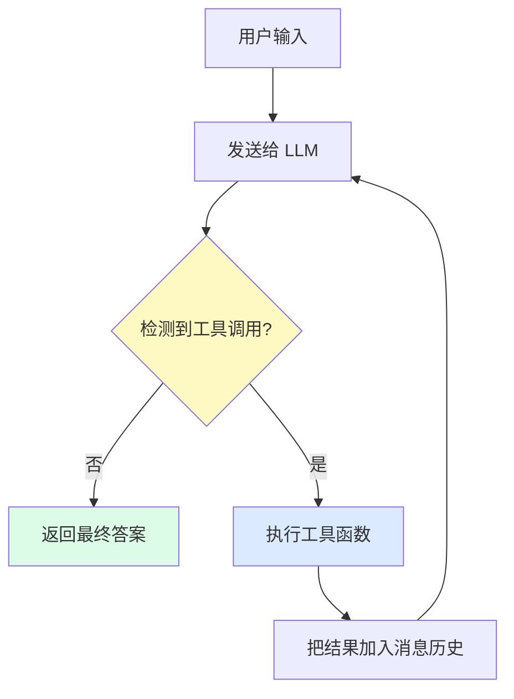
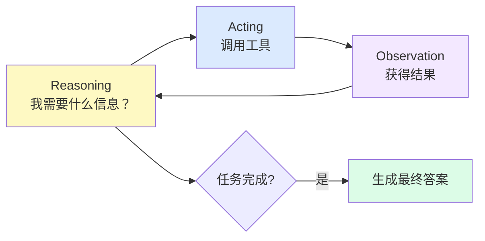

# 第三章：Agent 循环

## 本章目标

- [ ] 理解 Agent 循环的完整架构
- [ ] 掌握多工具协作的实现方式
- [ ] 理解循环终止条件的设计
- [ ] 理解 ReAct 模式（推理+行动）

---

## 0. 先记住：为什么一定要有 v4？

如果只看 `v3`，你可能会觉得：

“模型已经会调用函数了，为什么还要再做一个 Agent 框架？”

关键原因是：

**会调用一次函数，还不等于会完成一个多步骤任务。**

`v3` 解决的是：

- 模型能不能决定使用哪个工具
- 模型能不能把参数告诉程序
- 程序能不能执行这个工具，再把结果返回给模型

但 `v3` 还没有解决：

- 工具执行完以后，模型能不能继续下一步
- 如果任务需要两次、三次工具调用，该怎么接着做
- 什么时候才算任务真正完成

所以从 `v3` 走到 `v4`，本质上是在做一件事：

**把“一次函数调用”升级成“可以连续多步完成任务的循环系统”。**

这也是整个项目最关键的一跳。

---

## 1. v3 的局限：只能调用一次函数

v3 的 `chat()` 函数只处理了**一次**函数调用。  
这对于演示原理已经够了，但对真实任务通常还不够。

看一个更贴近当前项目代码的例子：

> 用户："今天是几月几号？今天是今年第几天？"

这个任务需要：
1. 调用 `get_current_time` 获取今天日期
2. 从日期中提取出 `YYYY-MM-DD`
3. 调用 `get_day_of_year` 计算今天是当年的第几天
4. 最后整理成自然语言回答用户

问题就在这里：

- 第一次工具调用后，任务其实还没结束
- 模型还需要根据新结果决定下一步
- 程序不能在第一步之后就停下来

而 `v3` 做不到这件事，因为它处理完第一次函数调用就结束了。

---

## 2. Agent 循环：让 LLM 自主决策直到完成

解决方案是把"发送请求 → 处理工具调用"变成一个**循环**，直到 LLM 不再需要调用工具为止：



这就是 **Agent 循环（Agentic Loop）**。循环的终止条件是 LLM 的回复中不再包含工具调用请求，意味着它认为任务完成了。

你也可以把它理解成一句更直白的话：

**只要模型还觉得“我还需要再查一点、算一步、做一个动作”，循环就继续。**

只有当模型直接开始正常回答，而不是继续请求工具时，循环才停止。

---

## 3. ReAct 模式

Agent 循环的学术名称是 **ReAct（Reasoning + Acting）**：
- **Reasoning（推理）**: LLM 思考下一步该做什么
- **Acting（行动）**: 执行工具调用获取信息
- **Observation（观察）**: 把工具结果反馈给 LLM
- 重复，直到任务完成



---

## 4. v4 代码讲解：完整 Agent 循环

v4 主要由一个文件组成：

| 文件 | 职责 |
|------|------|
| `code/v4_agent_loop.py` | 同时定义 `AgentLoop` 类，并提供注册工具、运行测试任务的示例入口 |

运行方式：
```bash
python code/v4_agent_loop.py
```

### 架构：在 v4 文件中复用 v3 的核心函数

v4 不再重复实现 Function Calling，而是**导入并复用** v3 的核心函数：

```python
from v3_with_functions import extract_tool_call, build_tools_prompt
```

这体现了迭代式开发：每个版本都基于前一版本的成果。

所以你可以把两版的关系理解成：

- `v3`：教你“单次工具调用”是怎么工作的
- `v4`：教你“把单次调用放进循环后，怎么变成 AgentLoop”

### AgentLoop 类实现

```python
class AgentLoop:
    def __init__(self, tools, functions, max_iterations=10, verbose=False):
        self.tools = tools
        self.functions = functions
        self.max_iterations = max_iterations
        self.verbose = verbose
        
        # 复用 v3 的 build_tools_prompt
        self.tools_prompt = build_tools_prompt(tools)
    
    def run(self, user_message: str) -> str:
        messages = [
            {"role": "system", "content": self.tools_prompt},
            {"role": "user", "content": user_message}
        ]
        
        for iteration in range(self.max_iterations):
            # 调用 LLM
            response = client.chat.completions.create(
                model="glm-4-flash",
                messages=messages
            )
            
            content = response.choices[0].message.content
            
            # 复用 v3 的 extract_tool_call
            tool_call = extract_tool_call(content)
            
            if tool_call is None:
                # 没有工具调用，任务完成
                return content
            
            # 执行工具
            tool_name = tool_call["tool"]
            result = self.functions[tool_name](**tool_call["args"])
            
            # 把结果加入消息历史，继续循环
            messages.append({"role": "assistant", "content": content})
            messages.append({
                "role": "user",
                "content": f"工具 {tool_name} 的执行结果：\n{result}"
            })
        
        return "错误：超过最大迭代次数"
```

### 防无限循环保护

使用 `max_iterations` 参数限制循环次数，防止 AgentLoop 陷入无限循环：

```python
agent = AgentLoop(tools=tools, functions=functions, max_iterations=10)
```

如果 10 次迭代后仍未完成，返回错误信息。

这也说明一件重要的事：

**Agent 并不是“魔法自动完成任务”，而是“在受控循环里一步一步推进任务”。**

循环可以让它更强，但也必须有边界条件和保护措施。

---

## 5. 常见问题

**Q: Agent 循环会无限运行吗？**
A: 正常情况下 LLM 会在任务完成后不再输出工具调用请求。但要加最大迭代次数作为保护，防止异常情况。

**Q: LLM 能一次调用多个工具吗？**
A: 理论上可以（在回复中输出多个 JSON），但我们的实现每次只处理一个工具调用，保持简单。

**Q: 怎么知道 Agent 在"思考"什么？**
A: 设置 `verbose=True`，打印每次循环的工具调用情况，可以看到 Agent 的推理路径。这也是调试 Agent 的主要方式。

**Q: 为什么 v4 代码比 v3 短很多？**
A: 因为 v4 复用了 v3 的核心函数（`extract_tool_call`、`build_tools_prompt`），只需要添加循环控制逻辑。这就是迭代式开发的优势。

---

## 6. 下一步

v4 实现了完整的 Agent 循环框架，现在把它应用到真实场景。

下一章，我们构建**网页总结工具**：给 Agent 添加"抓取网页"工具，让它能总结任意网页的内容。

继续：[第四章：网页总结工具 →](./04-web-summarizer.md)
