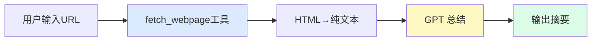

# 第四章：网页总结工具

## 本章目标

- [ ] 理解如何将 Agent 框架应用到真实场景
- [ ] 学习网页内容的抓取和清洗
- [ ] 掌握错误处理的设计原则
- [ ] 完成从零到一的完整应用

---

## 0. 这一章在验证什么？

到 `v4` 为止，你已经有了一个能循环调用工具的 Agent 框架。

这一章要验证的是：

**只靠前面手工搭出来的对话 API + 工具调用 + 循环机制，能不能拼成一个真实可用的小应用？**

这里依然没有引入任何原生 Agent 产品能力。  
我们只是把前面已经实现的基础机制，组合成一个具体场景：网页总结。

---

## 1. 任务拆解

网页总结工具需要做两件事：
1. **抓取网页** - 下载 HTML，提取正文文本
2. **总结内容** - 调用 GPT 生成摘要



这正是 v4 Agent 循环的使用场景：GPT 自主决定调用 `fetch_webpage` 工具，获取内容后生成总结。

---

## 2. 网页抓取的技术细节

### HTTP 请求

使用 `httpx` 库下载网页 HTML：

```python
import httpx

response = httpx.get(url, timeout=15, follow_redirects=True)
html = response.text
```

### HTML → 纯文本

网页 HTML 包含大量标签、脚本、样式，需要用 `BeautifulSoup` 提取正文：

```python
from bs4 import BeautifulSoup

soup = BeautifulSoup(html, "html.parser")

# 删除不需要的标签
for tag in soup(["script", "style", "nav", "footer", "header"]):
    tag.decompose()

# 提取纯文本
text = soup.get_text(separator="\n", strip=True)
```

### Token 限制处理

GPT 有上下文长度限制（gpt-4o-mini 约128K tokens），网页内容过长需要截断：

```python
MAX_CONTENT_CHARS = 8000  # 约2000个Token，留足够空间给回复

if len(text) > MAX_CONTENT_CHARS:
    text = text[:MAX_CONTENT_CHARS] + "\n...[内容已截断]"
```

---

## 3. v5 代码讲解

完整代码在 `code/v5_web_summarizer.py`，运行方式：
```bash
python code/v5_web_summarizer.py
```

### 与 v4 的主要变化

| 方面 | v4 | v5 |
|------|----|----|
| 工具 | 时间、计算 | 网页抓取 |
| 系统提示 | 无 | 有（指导总结风格） |
| 错误处理 | 基础 | 完善（网络错误、超时） |
| 用户界面 | 硬编码测试 | 交互式输入 |

---

## 4. 错误处理设计

网络请求可能失败，函数必须返回有用的错误信息（而不是抛出异常），让 GPT 知道出了什么问题：

```python
def fetch_webpage(url: str) -> str:
    try:
        response = httpx.get(url, timeout=15)
        response.raise_for_status()  # 检查HTTP状态码
        # ... 处理内容
    except httpx.TimeoutException:
        return "错误：请求超时，网页响应太慢"
    except httpx.HTTPStatusError as e:
        return f"错误：HTTP {e.response.status_code}，无法访问该网页"
    except Exception as e:
        return f"错误：{str(e)}"
```

**设计原则**：工具函数不应抛出异常，而应返回描述性错误字符串。GPT 收到错误信息后可以决定重试或告知用户。

---

## 5. 常见问题

**Q: 有些网页无法抓取怎么办？**
A: 部分网站有反爬措施（如Cloudflare保护）。简单情况可以添加 User-Agent 请求头模拟浏览器。

**Q: 内容太长 GPT 会截断吗？**
A: 会。建议在传给 GPT 前先截断到合理长度（8000字符），并在系统提示中说明内容可能不完整。

**Q: 能总结中文网页吗？**
A: 完全可以，GPT 支持多语言，中文网页直接抓取即可。

---

## 6. 下一步

v5 完成了一个完整的实用工具，但工具是硬编码的。如果想添加更多能力（文件操作、数据库查询、API 调用），需要为每个功能写代码。

下一章，我们学习 **MCP 协议集成**：通过标准化协议动态连接各种工具和数据源，让 Agent 的能力可以无限扩展。

继续：[第五章：MCP 协议集成 →](./05-mcp-integration.md)
