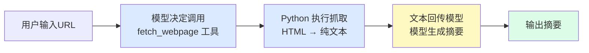
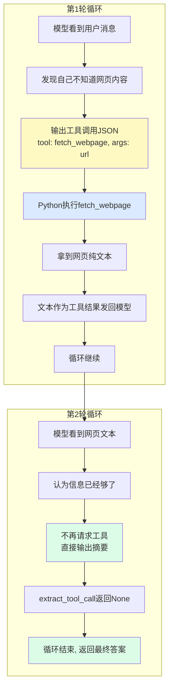
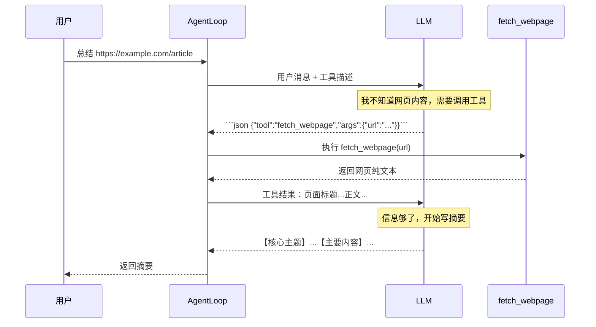

# 第四章：网页总结工具

## 本章目标

- [ ] 理解如何将 Agent 框架应用到真实场景
- [ ] 学习网页内容的抓取和清洗
- [ ] 掌握错误处理的设计原则
- [ ] 完成从零到一的完整应用

---

## 0. 这一章在验证什么？

到 `v4` 为止，你已经有了一个能循环调用工具的 Agent 框架。

这一章要验证的是：

**只靠前面手工搭出来的对话 API + 工具调用 + 循环机制，能不能拼成一个真实可用的小应用？**

这里依然没有引入任何原生 Agent 产品能力。  
我们只是把前面已经实现的基础机制，组合成一个具体场景：网页总结。

---

## 1. 任务拆解：从 v4 的循环到 v5 的具体场景

### 先想一个问题：用户说"帮我总结这个网页"，模型能做到吗？

用户输入一句话：

> "帮我总结一下这个网页的内容：https://example.com/article"

模型收到这句话后，面临的处境和 v3 开篇时一模一样：

- 模型能生成文字，但它**没有联网能力**，看不到那个 URL 里的内容
- 模型不知道网页讲了什么，也就无从"总结"

这正是 v3 解决过的问题：**模型需要工具来补上自己做不到的事。**

### 那这个任务要拆成几步？

站在模型的角度，"总结一个网页"其实只需要拆成两步：

| 步骤 | 谁来做 | 对应前面哪一版的概念 |
|------|--------|---------------------|
| ① 拿到网页内容 | 调用 `fetch_webpage` 工具 | v3：模型提出调用请求，Python 真正执行 |
| ② 根据内容生成摘要 | 模型自己完成 | v2：模型本身就有的文本生成能力 |

第一步是 v3 的 Function Calling —— 模型自己拿不到网页，但它可以"请求"你的程序去抓。

第二步不需要工具 —— 模型拿到文本后，生成摘要就是它的本职工作。

所以整个任务的分工是：**工具负责"拿到数据"，模型负责"理解数据"。**

用流程图画出来就是这样：


```mermaid
graph LR
    A[用户输入URL] --> B["模型决定调用<br/>fetch_webpage 工具"]
    B --> C["Python 执行抓取<br/>HTML → 纯文本"]
    C --> D["文本回传模型<br/>模型生成摘要"]
    D --> E[输出摘要]

    style B fill:#dbeafe
    style C fill:#dbeafe
    style D fill:#fef9c3
    style E fill:#dcfce7
```

蓝色两步是工具的事（v3），黄色是模型的事（v2），绿色是最终输出。整条管线里，**模型只做了一件事：决定何时调工具、拿到结果后怎么总结。**

### 这两步怎么落进 v4 的循环？

v4 的 Agent 循环是一个 `while`：只要模型还在请求工具，循环就继续；模型不再请求工具、直接给出自然语言回答时，循环就停止。

把上面的两步放进去，实际跑起来是这样：


```mermaid
graph TD
    subgraph 第1轮循环
        A1[模型看到用户消息] --> A2[发现自己不知道网页内容]
        A2 --> A3["输出工具调用JSON<br/>tool: fetch_webpage, args: url"]
        A3 --> A4[Python执行fetch_webpage]
        A4 --> A5[拿到网页纯文本]
        A5 --> A6[文本作为工具结果发回模型]
        A6 --> A7[循环继续]
    end

    A7 --> B1

    subgraph 第2轮循环
        B1[模型看到网页文本] --> B2[认为信息已经够了]
        B2 --> B3["不再请求工具<br/>直接输出摘要"]
        B3 --> B4["extract_tool_call返回None"]
        B4 --> B5[循环结束, 返回最终答案]
    end

    style A3 fill:#fef9c3
    style A4 fill:#dbeafe
    style B3 fill:#dcfce7
    style B5 fill:#dcfce7
```

再看一张从组件交互角度画的时序图，补充展示"谁在跟谁说话"：


```mermaid
sequenceDiagram
    participant U as 用户
    participant A as AgentLoop
    participant LLM as LLM
    participant F as fetch_webpage

    U->>A: 总结 https://example.com/article
    A->>LLM: 用户消息 + 工具描述
    Note over LLM: 我不知道网页内容，需要调用工具
    LLM-->>A: ```json {"tool":"fetch_webpage","args":{"url":"..."}}```
    A->>F: 执行 fetch_webpage(url)
    F-->>A: 返回网页纯文本
    A->>LLM: 工具结果：页面标题...正文...
    Note over LLM: 信息够了，开始写摘要
    LLM-->>A: 【核心主题】...【主要内容】...
    A-->>U: 返回摘要
```

你可能会注意到：这个例子只循环了两轮，和 v4 里"今天是几月几号？今天是今年第几天？"那种需要三步的任务相比，反而更简单。

那为什么还要用 v4 的循环框架？因为：

1. **框架不关心循环几轮** —— 不管是 2 轮还是 10 轮，循环的逻辑完全一样。你不需要为"只有一次工具调用"的场景单独写代码。
2. **错误情况天然兼容** —— 如果 `fetch_webpage` 返回的是错误信息（比如"请求超时"），模型会在下一轮看到这个错误，直接告诉用户"网页无法访问"，而不是卡住。这正是循环的容错价值。
3. **为更复杂的场景留了余地** —— 假如未来你想让 Agent 先抓网页、发现内容太长再分段、最后再合并摘要，循环框架已经能支持，不需要改结构。

### 系统提示：告诉模型"拿到内容后怎么总结"

v3 和 v4 的系统提示只解决了"有哪些工具可用"和"怎么调用"。但 v5 多了一个需求：**模型拿到网页内容后，应该按什么格式来总结？**

这就是 v5 代码里 `SYSTEM_PROMPT` 的作用：

```python
SYSTEM_PROMPT = """你是一个网页内容总结助手。
当用户提供网页URL时，使用 fetch_webpage 工具获取内容，然后生成结构清晰的中文摘要。

摘要格式：
1. 【核心主题】一句话说明文章讲什么
2. 【主要内容】3-5个要点（用"-"列出）
3. 【关键信息】数字、日期、人名等重要细节

如果网页无法访问，告知用户原因。"""
```

你可以这样理解它在整个流程中的位置：

- v3 的 `build_tools_prompt` → 告诉模型"你有什么工具"（机制层）
- v5 的 `SYSTEM_PROMPT` → 告诉模型"你该怎么做事"（策略层）

两者拼在一起，构成 v5 完整的 system prompt。工具描述让模型知道"可以调 `fetch_webpage`"，系统提示让模型知道"拿到内容后按三段式格式总结"。

### 小结：v5 相比 v4 到底改了什么？

回头看，从 v4 到 v5，Agent 循环本身一行没改 —— 你只是换了一组工具、加了一段系统提示：

| 改了什么 | v4 | v5 | 为什么 |
|---------|----|----|--------|
| 工具函数 | `get_current_time`、`calculate` 等 | `fetch_webpage` | 场景不同，需要的工具不同 |
| 工具定义 | 对应的 JSON Schema | 对应的 JSON Schema | 格式不变，v3 的机制照搬 |
| 系统提示 | 无 | 有（指导总结格式） | v3/v4 只管"怎么调工具"，v5 还要管"怎么做事" |
| 循环框架 | `AgentLoop` | 同一个 `AgentLoop` | 不需要改 |

这也验证了一件事：**v3 的工具机制 + v4 的循环机制是通用的，换一个场景只需要换工具和提示，框架本身可以复用。**

---

## 2. 网页抓取的技术细节

### HTTP 请求

使用 `httpx` 库下载网页 HTML：

```python
import httpx

response = httpx.get(url, timeout=15, follow_redirects=True)
html = response.text
```

### HTML → 纯文本

网页 HTML 包含大量标签、脚本、样式，需要用 `BeautifulSoup` 提取正文：

```python
from bs4 import BeautifulSoup

soup = BeautifulSoup(html, "html.parser")

# 删除不需要的标签
for tag in soup(["script", "style", "nav", "footer", "header"]):
    tag.decompose()

# 提取纯文本
text = soup.get_text(separator="\n", strip=True)
```

### Token 限制处理

每家大模型都有自己的上下文长度上限（少则几千 token，多则上百万）。再大的窗口，把整个网页原文塞进去也是浪费 —— 而且越大的输入意味着越多的费用和越慢的响应。所以我们对抓回来的文本统一截断：

```python
MAX_CONTENT_CHARS = 8000  # 约 2000 ~ 4000 token，留足空间给后续回复

if len(text) > MAX_CONTENT_CHARS:
    text = text[:MAX_CONTENT_CHARS] + "\n...[内容已截断]"
```

这是工具函数自己负责的边界控制 —— 工具不应该把"可能撑爆模型上下文"的责任丢给 Agent 循环。

---

## 3. v5 代码讲解

完整代码在 `code/v5_web_summarizer.py`，运行方式：
```bash
python code/v5_web_summarizer.py
```

### 代码结构一览

v5 的代码分成 5 个部分，每一部分都能在前面章节找到出处：

| 代码部分 | 对应概念 | 前面哪一章讲过 |
|---------|---------|----------------|
| `fetch_webpage` 函数 | 工具的具体实现 | 本章第 2 节（网页抓取的技术细节） |
| `tools` 列表 + `FUNCTIONS` 映射 | 工具定义和注册 | 第二章（v3 Function Calling） |
| `SYSTEM_PROMPT` | 系统提示（策略层） | 本章第 1 节 |
| `AgentLoop(...)` 实例化 | Agent 循环框架 | 第三章（v4 Agent Loop） |
| `while True` 交互入口 | 用户界面 | 本章新增 |

你会发现，v5 没有任何新机制 —— 每一段代码都能在前面找到出处。唯一的"新东西"是 `fetch_webpage` 的实现细节（第 2 节已讲）和交互式输入入口。

这也是第 1 节那张"v5 相比 v4 改了什么"表的代码级佐证：**循环框架一行没改，只是换了工具、加了提示。**

> 补充一点：v5 把 `max_iterations` 从 v4 的 10 降到了 5，因为网页总结通常只需要 1~2 轮循环，5 轮已经绰绰有余。这属于按场景调参，不是结构变化。

---

## 4. 错误处理设计

第 1 节提到过：如果 `fetch_webpage` 返回错误信息，模型会在下一轮循环看到它并告诉用户。这之所以能成立，前提是工具函数**返回错误而不是抛出异常**。

网络请求可能失败，函数必须返回有用的错误信息（而不是抛出异常），让 GPT 知道出了什么问题：

```python
def fetch_webpage(url: str) -> str:
    try:
        response = httpx.get(url, timeout=15)
        response.raise_for_status()  # 检查HTTP状态码
        # ... 处理内容
    except httpx.TimeoutException:
        return "错误：请求超时，网页响应太慢"
    except httpx.HTTPStatusError as e:
        return f"错误：HTTP {e.response.status_code}，无法访问该网页"
    except Exception as e:
        return f"错误：{str(e)}"
```

**设计原则**：工具函数不应抛出异常，而应返回描述性错误字符串。GPT 收到错误信息后可以决定重试或告知用户。

---

## 5. 常见问题

**Q: 有些网页无法抓取怎么办？**
A: 部分网站有反爬措施（如Cloudflare保护）。简单情况可以添加 User-Agent 请求头模拟浏览器。

**Q: 内容太长模型会截断吗？**
A: 超过模型上下文上限的部分会被丢掉。所以我们在 `fetch_webpage` 里就先截断到 8000 字符，并在系统提示中说明内容可能不完整。

**Q: 能总结中文网页吗？**
A: 完全可以。主流大模型都支持多语言，中文网页直接抓取即可。

---

## 6. 下一步

v5 完成了一个完整的实用工具，但工具是硬编码的。如果想添加更多能力（文件操作、数据库查询、API 调用），需要为每个功能写代码。

下一章，我们学习 **MCP 协议集成**：通过标准化协议动态连接各种工具和数据源，让 Agent 的能力可以无限扩展。

继续：[第五章：MCP 协议集成 →](./05-mcp-integration.md)
