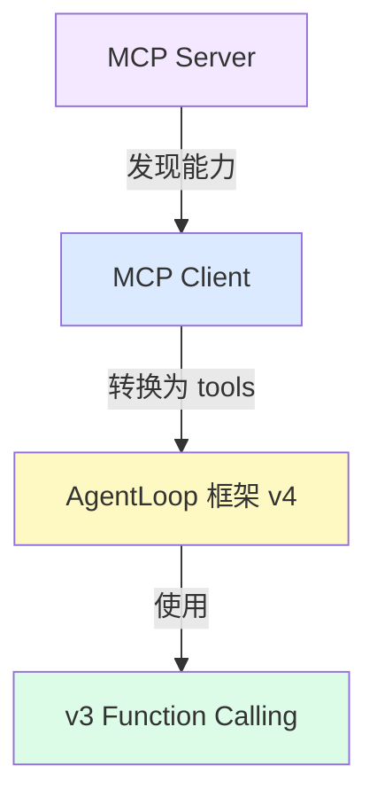

# 第五章：MCP 协议集成

## 本章目标

- [ ] 理解 MCP 协议的核心概念
- [ ] 掌握如何将 MCP 映射到 Function Calling 框架
- [ ] 实现 MCP Client 的基础架构
- [ ] 理解动态工具注册的设计模式

---

## 0. 这一章不是在“切换到原生 MCP Agent”

这一章很容易让人误解成：

“从这里开始，项目是不是改成依赖某个平台的原生 MCP 能力了？”

不是。

这一章仍然遵守本项目的核心原则：

- Agent 主体还是我们自己写的
- 对话入口还是最基础的对话 API
- MCP 只是被当作一种**外部工具协议**

也就是说，这一章做的事情不是“换一套新框架”，而是：

**把 MCP Server 提供的能力，翻译成我们现有 Agent 框架能理解的 tools/functions 结构。**

---

## 1. 什么是 MCP？

**MCP (Model Context Protocol)** 是 Anthropic 提出的标准化协议，用于连接 AI 应用和外部数据源/工具。

### 为什么需要 MCP？

传统方式：每个工具都需要单独集成
```python
# 需要为每个服务写专门的代码
def search_github(): ...
def query_database(): ...
def read_file(): ...
```

MCP 方式：统一的协议接口
```python
# 通过 MCP 协议自动发现和调用
mcp_client.connect("github-server")
mcp_client.connect("database-server")
# 工具自动可用
```

### 本项目里的 MCP 集成，和业界原生能力有什么区别？

在一些实际产品里，MCP 可能会被做成平台级能力，开发者只需要声明接入方式，平台就会帮你处理一部分发现、鉴权、编排或 UI 展示。

但在这个项目里，不是这样。

这里的做法更接近：

- 你自己连接 MCP Server
- 你自己读取它暴露出来的能力
- 你自己把这些能力转换成 `tools` 和 `functions`
- 最后仍然交给你自己的 Agent 循环去使用

所以这里学到的重点不是“怎么使用某个平台已经封装好的 MCP 功能”，而是：

**如果没有现成平台帮你封装，MCP 能力怎么接到你自己的 Agent 框架里。**

---

## 2. MCP 的三种能力

### Tools（工具）
可以被调用的函数，类似我们已经实现的 Function Calling。

```json
{
  "name": "search_files",
  "description": "在目录中搜索文件",
  "inputSchema": {
    "type": "object",
    "properties": {
      "pattern": {"type": "string"}
    }
  }
}
```

### Resources（资源）
可以被读取的数据源。

```json
{
  "uri": "file:///path/to/document.txt",
  "name": "项目文档",
  "mimeType": "text/plain"
}
```

### Prompts（提示模板）
预定义的提示词模板。

```json
{
  "name": "code_review",
  "description": "代码审查提示",
  "arguments": [
    {"name": "language", "description": "编程语言"}
  ]
}
```

---

## 3. 架构设计：复用现有框架

我们已经有了完整的 Function Calling 框架（v3 + v4），MCP 集成的核心思路是：

**将 MCP Server 的能力转换为我们的 AgentLoop 可用的 tools 格式**



### 关键设计决策

1. **MCP Tools → 直接映射**
   - MCP 的 tool 定义已经很接近我们的格式
   - 只需要做简单的字段转换

2. **MCP Resources → 包装成工具**
   - 创建一个通用的 `read_resource(uri)` 工具
   - 在工具描述中列出所有可用资源

3. **MCP Prompts → 可选功能**
   - 可以作为系统提示的一部分
   - 或者包装成 `get_prompt(name)` 工具

---

## 4. 实现：MCP Client 基础架构

### 核心类：MCPClient

```python
class MCPClient:
    """MCP 客户端，负责连接 Server 并转换能力"""
    
    def __init__(self):
        self.servers = {}  # server_name -> connection
        self.tools = []    # 聚合的工具列表
        self.functions = {}  # 工具名 -> 执行函数
    
    def connect(self, server_name: str, server_config: dict):
        """连接到 MCP Server"""
        # 1. 建立连接（stdio/HTTP/WebSocket）
        connection = self._create_connection(server_config)
        
        # 2. 发送 initialize 请求
        capabilities = connection.call("initialize", {
            "protocolVersion": "2024-11-05",
            "capabilities": {}
        })
        
        # 3. 获取 Server 提供的能力
        tools_list = connection.call("tools/list", {})
        resources_list = connection.call("resources/list", {})
        
        # 4. 转换为我们的格式
        self._register_tools(server_name, tools_list)
        self._register_resources(server_name, resources_list)
        
        self.servers[server_name] = connection
    
    def _register_tools(self, server_name: str, tools_list: dict):
        """将 MCP tools 转换为我们的格式"""
        for mcp_tool in tools_list.get("tools", []):
            # 转换格式
            tool = {
                "name": f"{server_name}_{mcp_tool['name']}",
                "description": mcp_tool.get("description", ""),
                "parameters": self._convert_schema(
                    mcp_tool.get("inputSchema", {})
                )
            }
            self.tools.append(tool)
            
            # 创建执行函数（闭包）
            def execute(**kwargs):
                return self._call_mcp_tool(
                    server_name, 
                    mcp_tool['name'], 
                    kwargs
                )
            
            self.functions[tool["name"]] = execute
    
    def _call_mcp_tool(self, server_name: str, tool_name: str, args: dict):
        """调用 MCP Server 的工具"""
        connection = self.servers[server_name]
        result = connection.call("tools/call", {
            "name": tool_name,
            "arguments": args
        })
        return result.get("content", [{}])[0].get("text", "")
```

### 与 AgentLoop 框架集成

```python
from v4_agent_loop import AgentLoop
from mcp_client import MCPClient

# 1. 创建 MCP Client 并连接 Server
mcp = MCPClient()
mcp.connect("filesystem", {
    "command": "npx",
    "args": ["-y", "@modelcontextprotocol/server-filesystem", "<项目根目录>"]
})

# 2. 直接使用 MCP 的 tools 和 functions
agent = AgentLoop(
    tools=mcp.tools,        # MCP 转换后的工具列表
    functions=mcp.functions  # MCP 工具的执行函数
)

# 3. AgentLoop 自动可以使用所有 MCP 工具
response = agent.run("列出当前项目的 code 目录下有哪些文件")
print(response)
```

---

## 5. v6 代码讲解：`code/v6_mcp_agent.py`

运行方式（需要先安装 Node.js）：
```bash
python code/v6_mcp_agent.py
```

### 核心函数 1：`connect()` — 连接并发现工具

```python
def connect(self, server_name: str, command: list):
    # 1. 启动 MCP Server 子进程（stdio 通信）
    process = subprocess.Popen(
        command, stdin=PIPE, stdout=PIPE, text=True
    )

    # 2. JSON-RPC 握手
    self._call_jsonrpc(process, "initialize", {
        "protocolVersion": "2024-11-05",
        "capabilities": {}
    })

    # 3. 获取工具列表
    tools_result = self._call_jsonrpc(process, "tools/list", {})

    # 4. 逐个注册工具
    for mcp_tool in tools_result["tools"]:
        self._register_tool(server_name, mcp_tool, process)
```

### 核心函数 2：`_register_tool()` — 格式转换

这是适配器模式的核心：把 MCP 格式转换为我们的框架格式。

```python
def _register_tool(self, server_name, mcp_tool, process):
    full_name = f"{server_name}_{mcp_tool['name']}"  # 加前缀避免命名冲突

    # MCP 格式 → 我们的 tools 格式
    tool = {
        "name": full_name,
        "description": mcp_tool["description"],
        "parameters": self._convert_input_schema(mcp_tool["inputSchema"])
    }
    self.tools.append(tool)

    # 创建执行函数（闭包捕获 process 和 tool_name）
    def execute(**kwargs):
        result = self._call_jsonrpc(process, "tools/call", {
            "name": mcp_tool["name"],
            "arguments": kwargs
        })
        return result["content"][0]["text"]

    self.functions[full_name] = execute
```

### 核心函数 3：`_call_jsonrpc()` — 协议通信

MCP 使用 JSON-RPC 2.0，通过标准输入输出与子进程通信：

```python
def _call_jsonrpc(self, process, method, params):
    request = {"jsonrpc": "2.0", "id": self.request_id, "method": method, "params": params}
    process.stdin.write(json.dumps(request) + "\n")
    process.stdin.flush()
    response = json.loads(process.stdout.readline())
    return response["result"]
```

### 与 AgentLoop 集成：一行代码

格式转换完成后，直接把 `mcp.tools` 和 `mcp.functions` 传给 AgentLoop——无需任何修改：

```python
mcp = MCPClient()
mcp.connect("fs", ["npx", "-y", "@modelcontextprotocol/server-filesystem", "<项目根目录>"])

agent = AgentLoop(
    tools=mcp.tools,       # MCPClient 生成的工具列表
    functions=mcp.functions  # MCPClient 生成的执行函数
)

agent.run("列出当前项目的 code 目录下有哪些文件")
```

---

## 6. 设计模式：动态工具注册

MCP 的核心价值是**动态发现和注册工具**，而不是硬编码。

### 传统方式（硬编码）

```python
tools = [
    {"name": "read_file", "description": "..."},
    {"name": "write_file", "description": "..."},
]

functions = {
    "read_file": lambda path: open(path).read(),
    "write_file": lambda path, content: open(path, "w").write(content),
}
```

### MCP 方式（动态注册）

```python
# 工具定义来自 MCP Server
mcp_client.connect("filesystem-server")
tools = mcp_client.tools  # 自动生成
functions = mcp_client.functions  # 自动生成

# 添加新能力只需连接新 Server
mcp_client.connect("database-server")
mcp_client.connect("github-server")
# tools 和 functions 自动更新
```

---

## 7. 常见问题

**Q: MCP 和 Function Calling 有什么区别？**
A: Function Calling 是 LLM 调用工具的机制，MCP 是工具提供方的标准协议。MCP Server 提供工具，Function Calling 调用工具。

**Q: 为什么要用 MCP 而不是直接写 Python 函数？**
A: MCP 的优势是标准化和可复用。一个 MCP Server 可以被任何支持 MCP 的 AI 应用使用，不需要重复开发。

**Q: 为什么示例不用 `/tmp` 了？**
A: 某些运行环境会限制 MCP Server 可访问的目录，`/tmp` 不一定总是允许。把允许目录直接设为当前项目根目录，更稳定，也更贴合本教程的教学场景。

**Q: MCP 支持哪些传输方式？**
A: stdio（标准输入输出）、HTTP、WebSocket。最简单的是 stdio，适合本地进程通信。

**Q: 如何处理 MCP Server 的错误？**
A: MCP 使用 JSON-RPC 2.0 协议，错误会在响应的 `error` 字段中返回。需要在 `_call_mcp_tool` 中添加错误处理。

---

## 8. 下一步

MCP 解决了"工具从哪来"的问题——通过标准协议动态接入外部能力。但工具多了之后，还有一个问题：**Agent 应该怎么用这些工具？**

下一章，我们学习 **Skill 机制**：将可复用的行为策略封装成 Markdown 文件，Agent 在运行时按需激活，让行为可以像工具一样动态扩展。

继续：[第六章：Skill 机制 →](./06-skills.md)
