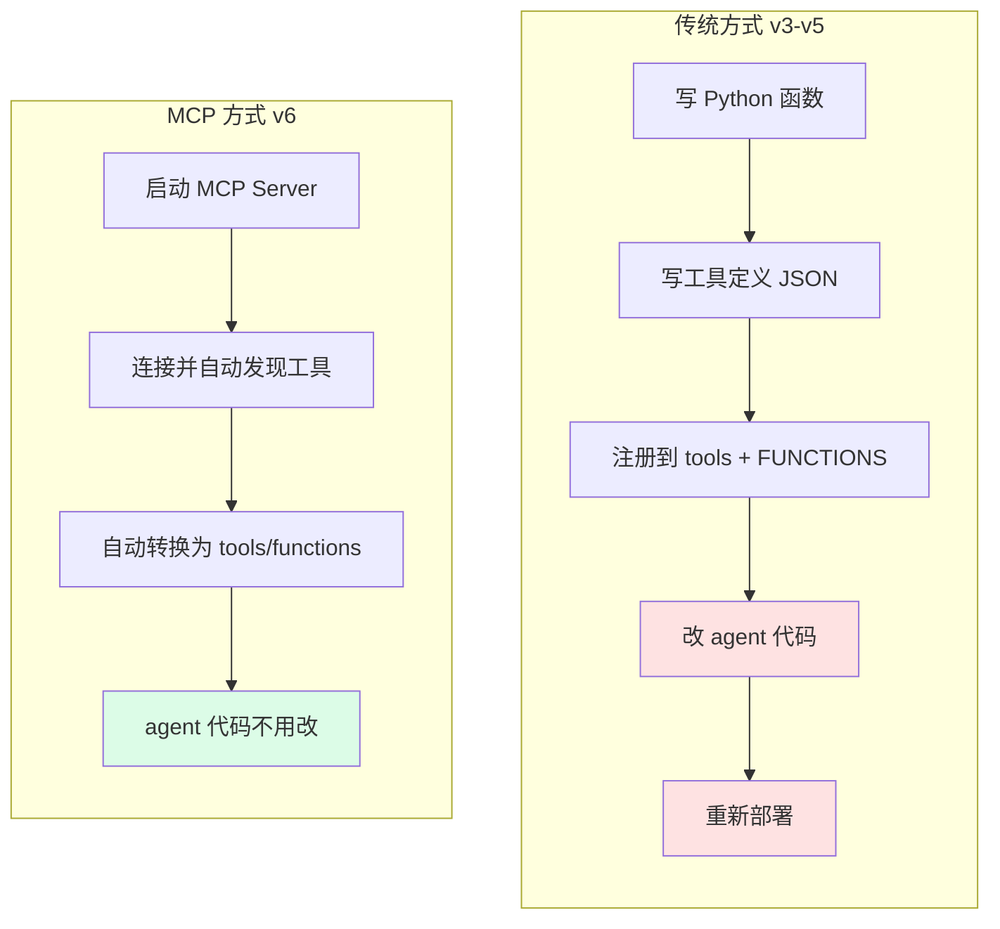
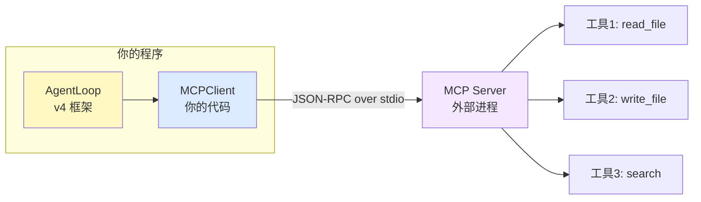
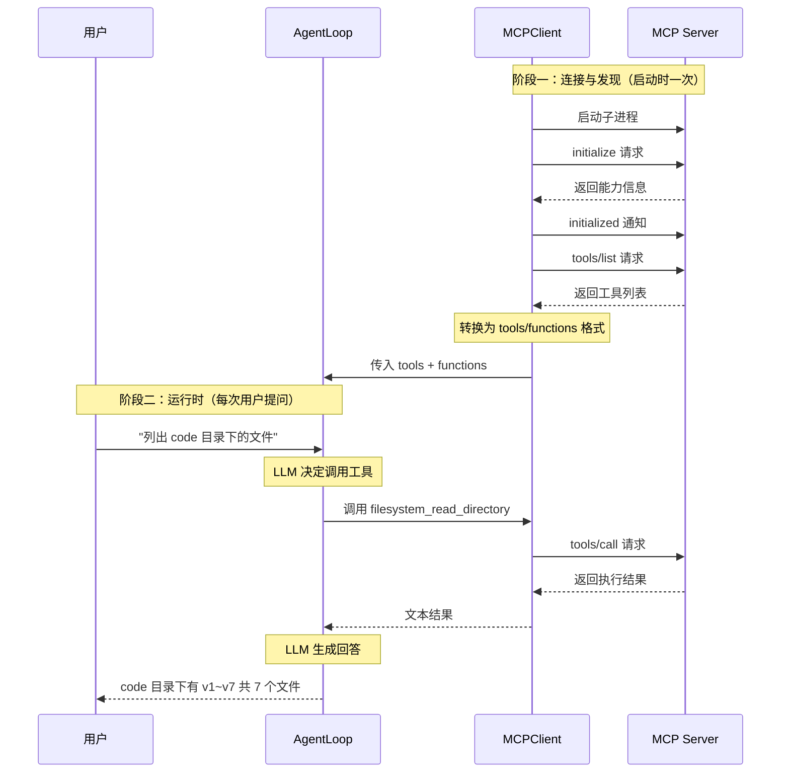
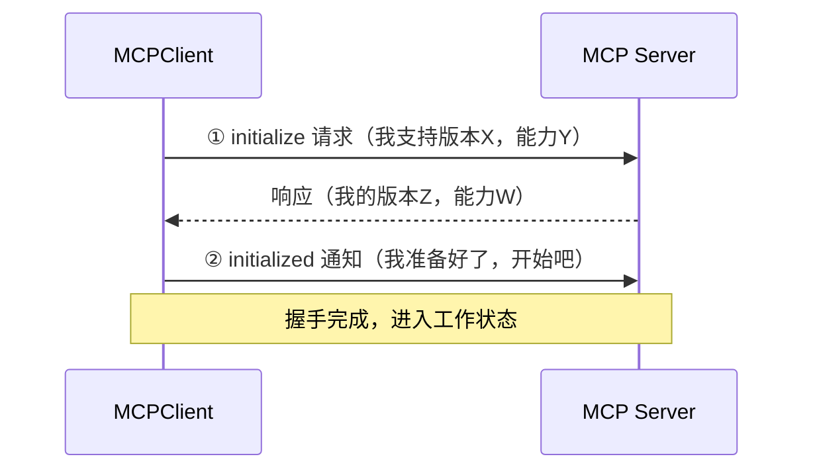

# 第五章：MCP 协议集成

## 本章目标

- [ ] 理解为什么需要 MCP——它解决了什么问题
- [ ] 掌握 MCP 的构成：Client、Server、传输、协议
- [ ] 理解 MCP 的交互流程：从连接到调用的完整生命周期
- [ ] 掌握如何将 MCP 映射到 Function Calling 框架
- [ ] 实现 MCP Client 的基础架构
- [ ] 理解动态工具注册的设计模式

---

## 0. 这一章不是在"切换到原生 MCP Agent"

这一章很容易让人误解成：

"从这里开始，项目是不是改成依赖某个平台的原生 MCP 能力了？"

不是。

这一章仍然遵守本项目的核心原则：

- Agent 主体还是我们自己写的
- 对话入口还是最基础的对话 API
- MCP 只是被当作一种**外部工具协议**

也就是说，这一章做的事情不是"换一套新框架"，而是：

**把 MCP Server 提供的能力，翻译成我们现有 Agent 框架能理解的 tools/functions 结构。**

---

## 1. 为什么需要 MCP：从 v5 的痛点说起

### v3 到 v5：每加一个工具，你要做三件事

回顾前面几章，你每添加一个工具，都需要重复这三步：

1. **写 Python 函数** —— 实现工具的具体逻辑
2. **写工具定义** —— 用 JSON Schema 描述工具名、描述、参数
3. **注册** —— 把函数放进 `FUNCTIONS` 字典，把定义放进 `tools` 列表

v5 的 `fetch_webpage` 就是这么来的：写了 `fetch_webpage()` 函数，写了它的工具定义，然后在 `FUNCTIONS` 和 `tools` 里各注册一行。

如果你想让 Agent 还能读文件、查数据库、搜 GitHub……每个能力都要重复这三步。而且所有工具都**写死在你的 agent 代码里**——想加能力就得改代码、改完还得重新部署。

### MCP 解决了什么问题？

MCP（Model Context Protocol）是 Anthropic 提出的标准化协议，核心思路是：

**工具不必由你手写，可以来自外部进程。**

- 外部进程（MCP Server）自己声明"我有哪些工具"
- 你的代码（MCP Client）连接它，自动发现并注册这些工具
- 想加新能力？连接一个新的 Server 就行，不用改 agent 代码

打个比方：以前每加一个工具，就像在主板上焊一个新芯片——你要自己动手、改电路。MCP 更像 USB 接口：任何符合标准的设备，插上就能用，你不需要改主板。

### 传统方式 vs MCP 方式


```mermaid
graph TD
    subgraph 传统方式 v3-v5
        direction TB
        T1[写 Python 函数] --> T2[写工具定义 JSON]
        T2 --> T3[注册到 tools + FUNCTIONS]
        T3 --> T4[改 agent 代码]
        T4 --> T5[重新部署]
    end

    subgraph MCP 方式 v6
        direction TB
        M1[启动 MCP Server] --> M2[连接并自动发现工具]
        M2 --> M3[自动转换为 tools/functions]
        M3 --> M4["agent 代码不用改"]
    end

    style T4 fill:#fee2e2
    style T5 fill:#fee2e2
    style M4 fill:#dcfce7
```

| | 传统方式（v3-v5） | MCP 方式（v6） |
|---|---|---|
| 新增工具 | 写函数 + 写定义 + 注册 | 连接一个新 Server |
| 工具来源 | 你自己的 Python 代码 | 任何外部进程 |
| 改 agent 代码 | 需要 | 不需要 |
| 工具复用 | 你的 agent 独享 | 任何支持 MCP 的 agent 都能用 |

### 本项目里的 MCP 集成，和业界原生能力有什么区别？

在一些实际产品里，MCP 可能会被做成平台级能力，开发者只需要声明接入方式，平台就会帮你处理一部分发现、鉴权、编排或 UI 展示。

但在这个项目里，不是这样。

这里的做法更接近：

- 你自己连接 MCP Server
- 你自己读取它暴露出来的能力
- 你自己把这些能力转换成 `tools` 和 `functions`
- 最后仍然交给你自己的 Agent 循环去使用

所以这里学到的重点不是"怎么使用某个平台已经封装好的 MCP 功能"，而是：

**如果没有现成平台帮你封装，MCP 能力怎么接到你自己的 Agent 框架里。**

---

## 2. MCP 的构成：Client、Server、传输、协议

MCP 不是一个程序，而是一套协议规范。它定义了两个角色怎么对话：


```mermaid
graph LR
    subgraph 你的程序
        A["AgentLoop<br/>v4 框架"] --> B["MCPClient<br/>你的代码"]
    end
    B -->|JSON-RPC over stdio| C["MCP Server<br/>外部进程"]
    C --> D["工具1: read_file"]
    C --> E["工具2: write_file"]
    C --> F["工具3: search"]

    style A fill:#fef9c3
    style B fill:#dbeafe
    style C fill:#f3e8ff
```

### 四个角色

| 角色 | 是谁 | 职责 |
|------|------|------|
| **MCP Server** | 外部进程 | 声明"我有哪些工具"，执行工具调用，返回结果 |
| **MCP Client** | 你的代码 | 连接 Server，发现工具，转换为框架格式，转发调用 |
| **Transport** | 通信通道 | Client 和 Server 之间怎么传消息（stdio / HTTP / WebSocket） |
| **Protocol** | JSON-RPC 2.0 | 消息的格式规范 |

### 传输方式：stdio

本项目用的是 **stdio**：MCP Server 是一个子进程，Client 往它的 stdin 写请求，从它的 stdout 读响应。

为什么用 stdio？因为最简单——不需要开端口、不需要管网络，启动一个子进程就能通信。其他传输方式（HTTP、WebSocket）原理一样，只是换了通信通道。

### 协议：JSON-RPC 2.0

Client 和 Server 之间发的每一条消息都是 JSON-RPC 2.0 格式。只有两种消息类型：

| 类型 | 有 id 吗 | 对方会回响应吗 | 例子 |
|------|---------|---------------|------|
| **请求**（request） | 有 | 会 | "请把你的工具列表给我" |
| **通知**（notification） | 没有 | 不会 | "我已经准备好了" |

这个区分在下一节的交互流程里会用到，先记住就行。

### MCP 能力如何映射到我们的框架

MCP Server 可以暴露三种能力，我们关注的是怎么把它们转换成 v3/v4 框架的 `tools` 和 `functions`：

| MCP 能力 | 是什么 | 我们怎么用 |
|---------|--------|-----------|
| **Tools** | 可调用的函数 | 直接映射为我们的 `tools` + `functions`（主要使用） |
| **Resources** | 可读取的数据源 | 包装成一个 `read_resource(uri)` 工具 |
| **Prompts** | 预定义的提示词模板 | 可选：作为系统提示的一部分 |

本项目只实现了 Tools 的映射，因为这是最核心、最常用的能力。Resources 和 Prompts 的思路类似，理解了 Tools 的映射方式就能举一反三。

---

## 3. MCP 的三种能力

MCP Server 可以暴露三种能力，下面是各自的 JSON 格式。理解格式有助于你在 `_register_tool()` 里看懂转换过程。

### Tools（工具）
可以被调用的函数，类似我们已经实现的 Function Calling。

```json
{
  "name": "search_files",
  "description": "在目录中搜索文件",
  "inputSchema": {
    "type": "object",
    "properties": {
      "pattern": {"type": "string"}
    }
  }
}
```

### Resources（资源）
可以被读取的数据源。

```json
{
  "uri": "file:///path/to/document.txt",
  "name": "项目文档",
  "mimeType": "text/plain"
}
```

### Prompts（提示模板）
预定义的提示词模板。

```json
{
  "name": "code_review",
  "description": "代码审查提示",
  "arguments": [
    {"name": "language", "description": "编程语言"}
  ]
}
```

---

## 4. 交互流程：从连接到调用的完整生命周期

### 两个阶段

MCP 的交互分为两个阶段，时间上完全分开——**阶段一在启动时做一次，阶段二在每次用户提问时重复**：


```mermaid
sequenceDiagram
    participant U as 用户
    participant A as AgentLoop
    participant C as MCPClient
    participant S as MCP Server

    Note over C,S: 阶段一：连接与发现（启动时一次）
    C->>S: 启动子进程
    C->>S: initialize 请求
    S-->>C: 返回能力信息
    C->>S: initialized 通知
    C->>S: tools/list 请求
    S-->>C: 返回工具列表
    Note over C: 转换为 tools/functions 格式
    C->>A: 传入 tools + functions

    Note over U,A: 阶段二：运行时（每次用户提问）
    U->>A: "列出 code 目录下的文件"
    Note over A: LLM 决定调用工具
    A->>C: 调用 filesystem_read_directory
    C->>S: tools/call 请求
    S-->>C: 返回执行结果
    C-->>A: 文本结果
    Note over A: LLM 生成回答
    A-->>U: code 目录下有 v1~v7 共 7 个文件
```

### 阶段一：连接与发现（启动时一次）

Agent 启动时，MCPClient 做五件事：

1. **启动子进程** —— 把 MCP Server 作为一个子进程跑起来
2. **握手三步** —— `initialize` 请求 → Server 响应 → `initialized` 通知（下一节详细讲）
3. **发现工具** —— 发 `tools/list` 请求，拿到 Server 声明的所有工具
4. **格式转换** —— 把 MCP 格式转成我们的 `tools` 列表和 `functions` 字典
5. **交给 AgentLoop** —— 把转换好的 `tools` 和 `functions` 传给 v4 的 AgentLoop

完成后，AgentLoop 就跟 v5 时一模一样了——它不知道工具是手写的还是 MCP 来的，因为格式完全相同。

### 阶段二：运行时（每次用户提问）

用户提问后，循环和 v4 完全一样，唯一区别在"执行工具"这一步：

| 步骤 | v4（手写工具） | v6（MCP 工具） |
|------|---------------|---------------|
| 模型决定调用工具 | ✅ | ✅ |
| 找到对应函数 | `FUNCTIONS[name]` | `mcp.functions[name]` |
| 执行函数 | 直接调 Python 函数 | 闭包发 `tools/call` 给 Server |
| 拿到结果 | 函数返回值 | Server 返回的文本 |
| 结果发回模型 | ✅ | ✅ |

唯一的变化在"执行函数"——从"直接调 Python"变成"通过 JSON-RPC 让 Server 执行"。其他所有环节，AgentLoop 一行没改。

---

## 5. v6 代码讲解

完整代码在 `code/v6_mcp_agent.py`，运行方式：
```bash
python code/v6_mcp_agent.py
```

### 快速开始：先跑通再理解

如果你想先看到效果，直接运行：

```bash
python code/v6_mcp_agent.py
```

本文件会自动启动纯 Python 的 `v6_mcp_mock_server.py` 作为子进程，提供 `echo`、`add`、`greet`、`read_file`、`list_directory`、`write_file` 等工具。看到 Agent 能调用 MCP Server 提供的工具，说明通了。

### 阅读建议

v6 涉及 JSON-RPC 协议和进程通信，概念跳跃较大。建议按以下顺序理解：

1. **先跑通**：运行上面的示例，看到 Agent 能调工具
2. **理解转换**：看 `_register_tool()` 如何把 MCP 格式转成我们的格式
3. **深入协议**：再理解三步握手、JSON-RPC 请求/通知的区别

不必一次全懂，先建立整体印象。

### 核心函数 1：`connect()` — 连接并发现工具

这是阶段一的主函数，对应第 4 节交互流程图里的"连接与发现"：

```python
def connect(self, server_name: str, command: list):
    # 1. 启动 MCP Server 子进程（stdio 通信）
    process = subprocess.Popen(
        command, stdin=PIPE, stdout=PIPE, text=True
    )

    # 2. JSON-RPC 握手第一步：发送 initialize 请求
    self._call_jsonrpc(process, "initialize", {
        "protocolVersion": "2024-11-05",
        "capabilities": {}
    })

    # 3. 握手第三步：发送 initialized 通知（不是请求！没有 id、不等响应）
    self._send_notification(process, "notifications/initialized", {})

    # 4. 获取工具列表
    tools_result = self._call_jsonrpc(process, "tools/list", {})

    # 5. 逐个注册工具
    for mcp_tool in tools_result["tools"]:
        self._register_tool(server_name, mcp_tool, process)
```

### MCP 握手的本质：三步，不是一步

很多人第一次看 MCP 实现，会以为握手就是"发一个 `initialize`、拿到响应、开始用"。但完整握手其实是**三步**：


```mermaid
sequenceDiagram
    participant C as MCPClient
    participant S as MCP Server

    C->>S: ① initialize 请求（我支持版本X，能力Y）
    S-->>C: 响应（我的版本Z，能力W）
    C->>S: ② initialized 通知（我准备好了，开始吧）
    Note over C,S: 握手完成，进入工作状态
```

1. **client → server**：`initialize` 请求 —— 告诉 server"我支持的协议版本是 X，我的能力是 Y"
2. **server → client**：响应 —— server 返回它自己的版本、能力、信息
3. **client → server**：`notifications/initialized` **通知** —— 告诉 server"我看到你的响应了，可以正式开始用了"

这里藏着一个 JSON-RPC 协议的本质细节：**第 3 步是通知（notification），不是请求（request）**。这两种消息的形态是不同的：

| 类型 | 有 id 吗 | server 会回响应吗 | 适用场景 |
|---|---|---|---|
| **请求**（request） | 有 | 会 | 我需要拿到一个结果，比如调用工具 |
| **通知**（notification） | 没有 | 不会 | 我只是告诉你一件事，不等你回话 |

这就是为什么 v6 代码里专门有两个方法 —— `_call_jsonrpc` 处理请求（发完读 stdout 拿响应），`_send_notification` 处理通知（发完就返回，没有响应可读）。两者用同一个方法实现不了，因为它们在协议层就是不同形态的消息。

**漏掉第 3 步会怎样？** 对宽松的 server（比如本项目里的 `v6_mcp_mock_server.py`）能跑通 —— 它不在乎你有没有发 `initialized`，照样接受后续请求。但对严格按 spec 实现的 server，它会一直等着你发 `initialized`，没收到就拒绝处理 `tools/list` 之类的请求，于是客户端就卡死在握手阶段。

所以握手三步**不是冗余设计**：它确立了一个清晰的协议状态机 —— 在 `initialized` 之前，连接处于"协商中"，只能交换版本信息；在 `initialized` 之后，连接才进入"工作中"，可以用所有能力。漏掉中间这一步，就是把状态机砍掉了。

### 核心函数 2：`_register_tool()` — 格式转换

这是适配器模式的核心：把 MCP 格式转换为我们的框架格式。

```python
def _register_tool(self, server_name, mcp_tool, process):
    full_name = f"{server_name}_{mcp_tool['name']}"  # 加前缀避免命名冲突

    # MCP 格式 → 我们的 tools 格式
    tool = {
        "name": full_name,
        "description": mcp_tool["description"],
        "parameters": self._convert_input_schema(mcp_tool["inputSchema"])
    }
    self.tools.append(tool)

    # 创建执行函数（闭包捕获 process 和 tool_name）
    def execute(**kwargs):
        result = self._call_jsonrpc(process, "tools/call", {
            "name": mcp_tool["name"],
            "arguments": kwargs
        })
        return result["content"][0]["text"]

    self.functions[full_name] = execute
```

注意那个闭包：`execute` 函数捕获了 `process` 和 `mcp_tool["name"]`。当 AgentLoop 在运行时调用 `mcp.functions["fs_read_file"](...)` 时，这个闭包就会往对应的 Server 子进程发一条 `tools/call` 的 JSON-RPC 请求——这就是第 4 节交互流程图里"阶段二"发生的事。

### 核心函数 3：`_call_jsonrpc()` — 协议通信

MCP 使用 JSON-RPC 2.0，通过标准输入输出与子进程通信：

```python
def _call_jsonrpc(self, process, method, params):
    request = {"jsonrpc": "2.0", "id": self.request_id, "method": method, "params": params}
    process.stdin.write(json.dumps(request) + "\n")
    process.stdin.flush()
    response = json.loads(process.stdout.readline())
    return response["result"]
```

### 与 AgentLoop 集成：一行代码

格式转换完成后，直接把 `mcp.tools` 和 `mcp.functions` 传给 AgentLoop——无需任何修改：

```python
mcp = MCPClient()
mcp.connect("fs", ["python", "code/v6_mcp_mock_server.py"])

agent = AgentLoop(
    tools=mcp.tools,       # MCPClient 生成的工具列表
    functions=mcp.functions  # MCPClient 生成的执行函数
)

agent.run("列出当前项目的 code 目录下有哪些文件")
```

---

## 6. 设计模式：动态工具注册

MCP 的核心价值是**动态发现和注册工具**，而不是硬编码。

### 传统方式（硬编码）

```python
tools = [
    {"name": "read_file", "description": "..."},
    {"name": "write_file", "description": "..."},
]

functions = {
    "read_file": lambda path: open(path).read(),
    "write_file": lambda path, content: open(path, "w").write(content),
}
```

### MCP 方式（动态注册）

```python
# 工具定义来自 MCP Server
mcp_client.connect("filesystem-server")
tools = mcp_client.tools  # 自动生成
functions = mcp_client.functions  # 自动生成

# 添加新能力只需连接新 Server
mcp_client.connect("database-server")
mcp_client.connect("github-server")
# tools 和 functions 自动更新
```

---

## 7. 常见问题

**Q: MCP 和 Function Calling 有什么区别？**
A: Function Calling 是 LLM 调用工具的机制，MCP 是工具提供方的标准协议。MCP Server 提供工具，Function Calling 调用工具。

**Q: 为什么要用 MCP 而不是直接写 Python 函数？**
A: MCP 的优势是标准化和可复用。一个 MCP Server 可以被任何支持 MCP 的 AI 应用使用，不需要重复开发。

**Q: 为什么示例不用 `/tmp` 了？**
A: 某些运行环境会限制 MCP Server 可访问的目录，`/tmp` 不一定总是允许。把允许目录直接设为当前项目根目录，更稳定，也更贴合本教程的教学场景。

**Q: MCP 支持哪些传输方式？**
A: stdio（标准输入输出）、HTTP、WebSocket。最简单的是 stdio，适合本地进程通信。

**Q: 如何处理 MCP Server 的错误？**
A: MCP 使用 JSON-RPC 2.0 协议，错误会在响应的 `error` 字段中返回。需要在 `_call_mcp_tool` 中添加错误处理。

---

## 8. 下一步

MCP 解决了"工具从哪来"的问题——通过标准协议动态接入外部能力。但工具多了之后，还有一个问题：**Agent 应该怎么用这些工具？**

下一章，我们学习 **Skill 机制**：将可复用的行为策略封装成 Markdown 文件，Agent 在运行时按需激活，让行为可以像工具一样动态扩展。

继续：[第六章：Skill 机制 →](./06-skills.md)
