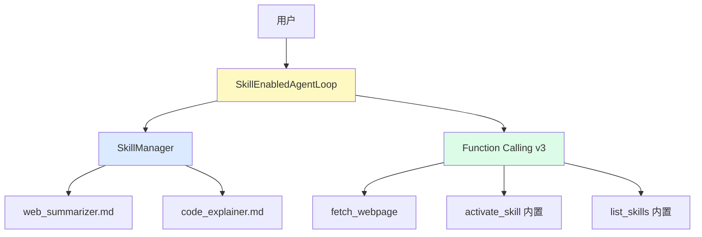
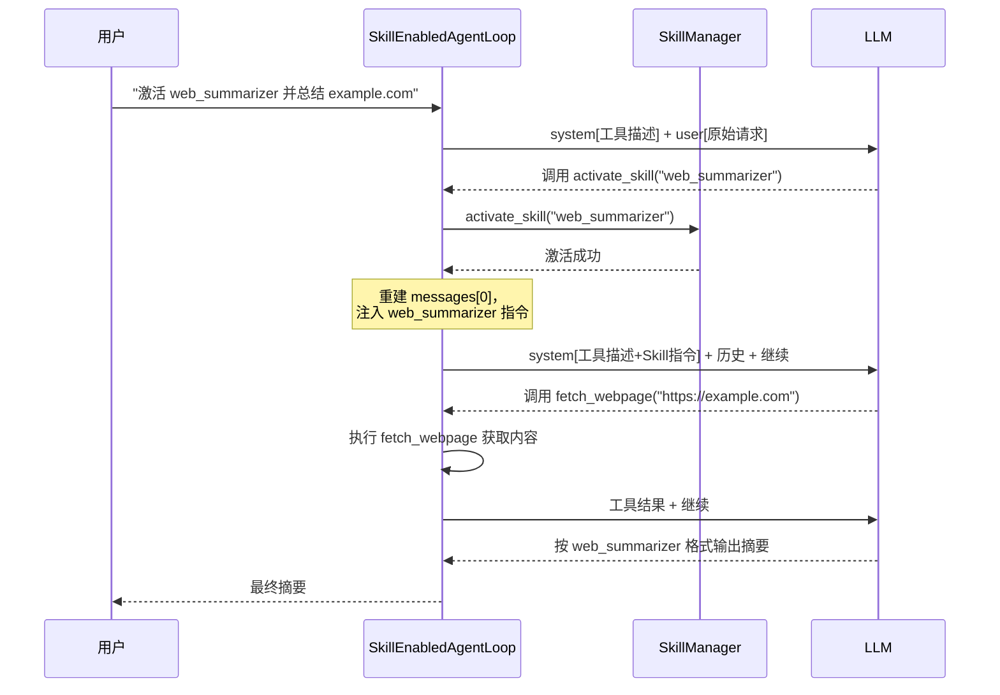

# 第六章：Skill 机制

## 本章目标

- [ ] 理解 Skill 机制解决的问题
- [ ] 掌握 Skill 文件的定义格式
- [ ] 理解运行时动态激活的实现原理
- [ ] 理解与工具（Tool）的关键区别

---

## 0. 这一章也不是在调用“平台自带 Skills”

这里的 Skill 不是某个厂商产品里已经做好的原生能力。

本项目里的 Skill，仍然是我们在现有框架上手工实现出来的一层抽象：

- 底层还是最基础的对话 API
- 工具调用还是前面已经实现的 Function Calling
- Agent 循环还是我们自己写的 `Agent`

这一章新增的，只是：

**把一组可复用的行为说明，整理成 Markdown 文件，并在运行时动态加载。**

所以你看到的 Skill 机制，本质上是在演示“行为策略也可以模块化”，而不是依赖原生平台特性。

---

## 1. 问题：工具越多，Agent 越难用

随着 Agent 能力增长，工具列表会膨胀：

```python
tools = [
    {"name": "fetch_webpage", ...},
    {"name": "search_web", ...},
    {"name": "read_file", ...},
    {"name": "run_code", ...},
    {"name": "query_db", ...},
    # ... 越来越多
]
```

工具多了之后出现两个问题：
1. **系统提示变长**：所有工具描述都塞进 system prompt，模型难以聚焦
2. **行为难以定制**：工具只定义"能做什么"，不定义"怎么做、以什么风格"

### 本项目里的 Skill，和业界原生能力有什么区别？

在一些实际产品里，Skills 可能是平台直接支持的能力单元，系统会帮你处理激活、权限、界面展示，甚至和其他能力自动联动。

但在这个项目里，Skill 只是一个我们自己定义出来的约定：

- 用 Markdown 文件保存说明
- 用 frontmatter 保存元数据
- 用 `SkillManager` 扫描、加载和激活
- 再把激活后的指令手动注入系统提示

所以这里学到的重点不是“会用某个平台的 Skills 功能”，而是：

**如果平台没有内置 Skill 系统，你也可以自己在 Agent 框架上做一层行为模块化。**

---

## 2. Skill vs Tool：两种不同层次的能力

| | Tool（工具）| Skill（技能）|
|---|---|---|
| **定义** | 单个函数，做一件事 | 行为模式，包含策略和风格 |
| **内容** | 函数签名 + 描述 | 系统指令 + 工具组合 + 输出格式 |
| **粒度** | 原子操作 | 组合任务 |
| **示例** | `fetch_webpage(url)` | web_summarizer（使用 fetch_webpage，按特定格式输出摘要）|

**类比**：Tool 是锤子、螺丝刀；Skill 是"装修"（知道什么时候用锤子，什么时候用螺丝刀，按什么顺序）。

---

## 3. Skill 文件格式

Skill 是一个 Markdown 文件，包含 frontmatter 元数据和指令正文：

```markdown
---
name: web_summarizer
description: 总结网页内容的专家
tools:
  - fetch_webpage
---

# 指令正文

你现在是一个网页总结专家。当用户提供 URL 时：

1. 使用 fetch_webpage 工具获取内容
2. 提取核心观点（3-5 个）
3. 按以下格式输出：

## 输出格式
...
```

**frontmatter 字段说明**：
- `name`：Skill 唯一名称，Agent 激活时用这个名字
- `description`：一句话描述，Agent 看到这个决定激活哪个 Skill
- `tools`：该 Skill 依赖的工具列表（需要在 Agent 中注册）

---

## 4. 架构：三层关系



`SkillEnabledAgentLoop` 继承 v4 的 `AgentLoop`，添加了：
1. `SkillManager`：扫描 `skills/` 目录，管理激活状态
2. 两个内置工具：`list_skills`、`activate_skill`
3. 覆盖 `run()` 方法：每次调用 `activate_skill` 后立即更新系统提示

---

## 5. v7 代码讲解

完整代码在 `code/v7_agent_with_skills.py`，运行方式：
```bash
python code/v7_agent_with_skills.py
```

### Skill 类：从文件加载

```python
class Skill:
    @classmethod
    def from_file(cls, file_path: str) -> 'Skill':
        """从 Markdown 文件加载 Skill"""
        with open(file_path, 'r', encoding='utf-8') as f:
            content = f.read()

        # 解析 frontmatter（--- 之间的 YAML）
        parts = content.split('---', 2)
        frontmatter = yaml.safe_load(parts[1])
        instructions = parts[2].strip()

        return cls(
            name=frontmatter['name'],
            description=frontmatter['description'],
            instructions=instructions,
            tools=frontmatter.get('tools', [])
        )
```

### SkillManager：发现和激活

```python
class SkillManager:
    def __init__(self, skills_dir):
        self.skills = {}
        self.active_skills = []
        self._discover_skills()  # 自动扫描目录

    def activate_skill(self, skill_name: str):
        """激活一个 Skill"""
        self.active_skills.append(skill_name)

    def get_active_instructions(self) -> str:
        """拼接所有激活 Skill 的指令，注入到系统提示"""
        return "\n\n---\n\n".join(
            skill.instructions for skill in self.active_skills
        )
```

### SkillEnabledAgentLoop：关键设计——Skill 激活后立即更新系统提示

这是 v7 最重要的设计：Skill 被激活后，Agent 立即重建 `messages[0]`（系统消息），让新指令在**同轮对话**内生效，不需要重新发起请求：

```python
# 每次调用工具后检查是否激活了 Skill
if tool_name == "activate_skill":
    # 重建系统提示，注入新激活的 Skill 指令
    messages[0] = {
        "role": "system",
        "content": self._build_system_prompt()
    }
    # 下一次迭代 LLM 就能看到新指令了
```

完整的系统提示构建：

```python
def _build_system_prompt(self, base_prompt=None) -> str:
    parts = []
    if base_prompt:
        parts.append(base_prompt)
    # 追加所有激活 Skill 的指令
    skill_instructions = self.skill_manager.get_active_instructions()
    if skill_instructions:
        parts.append("# 激活的 Skills\n\n" + skill_instructions)
    # 最后加工具描述
    parts.append(self.tools_prompt)
    return "\n\n".join(parts)
```

---

## 6. 执行流程：激活 Skill 并完成任务

以"激活 web_summarizer 并总结网页"为例：



---

## 7. 如何添加新 Skill

只需在 `skills/` 目录创建一个 `.md` 文件：

```markdown
---
name: translator
description: 专业翻译助手，支持中英日韩互译
tools: []
---

# 翻译 Skill

你现在是一个专业翻译。翻译时：
- 保持原文语气和风格
- 专业术语优先使用行业标准译法
- 输出格式：原文 / 译文 对照

## 输出格式

**原文**：[原文]
**译文**：[译文]
**备注**：[如有特殊处理说明]
```

重启 Agent 后该 Skill 自动可用，无需修改任何代码。

---

## 8. 与 MCP 的对比

| | MCP（v6）| Skill（v7）|
|---|---|---|
| **扩展的是** | 工具（能做什么）| 行为（怎么做）|
| **定义方式** | Server 进程 | Markdown 文件 |
| **运行位置** | 独立进程 | Agent 内存 |
| **适合场景** | 集成外部系统 | 定制 Agent 行为 |

两者可以组合：MCP 提供工具，Skill 定义使用这些工具的策略。

---

## 9. 常见问题

**Q: Skill 指令会使系统提示变得很长吗？**
A: 只有激活的 Skill 才会注入，未激活的不占用上下文。合理设计下不会有问题。

**Q: 可以同时激活多个 Skill 吗？**
A: 可以，`SkillManager` 维护一个 `active_skills` 列表，所有激活的 Skill 指令都会拼接进系统提示。

**Q: Skill 之间有冲突怎么办？**
A: 应避免同时激活职责重叠的 Skill。可以在 `activate_skill` 里加互斥逻辑，或让 LLM 自己判断。

**Q: Skill 能调用其他 Skill 吗？**
A: 不直接支持。但 LLM 在一次对话里可以连续调用 `activate_skill` 激活多个 Skill，实现类似效果。

---

## 10. 总结：迭代演进路线

| 版本 | 核心概念 | 复用自 | 新增内容 |
|------|----------|--------|---------|
| v3 | Function Calling | v2 | `extract_tool_call`、`build_tools_prompt` |
| v4 | Agent 循环 | v3 | 多轮循环、`AgentLoop` 类 |
| v5 | 真实应用 | v4 | `fetch_webpage` 工具 |
| v6 | MCP 集成 | v4 | `MCPClient` 适配器 |
| v7 | Skill 机制 | v4 | `SkillManager`、`SkillEnabledAgentLoop` |

每个版本只添加一个核心概念，核心框架保持稳定。
